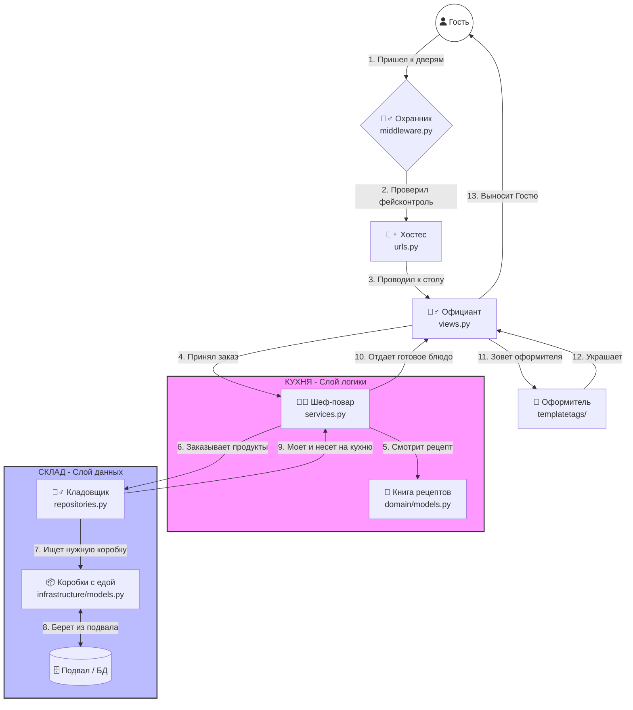

# 🗺️ Визуальная схема "Ресторана" (DDD)

Скопируй этот код в свой Obsidian, чтобы получить интерактивную карту:

### Как читать эту схему на защите:
1. **Запрос (Гость)** заходит в систему.
2. **Middleware (Охранник)** — первая линия обороны (время, лимиты).
3. **URLs (Хостес)** — решает, какой **View (Официант)** будет обслуживать.
4. **View** не думает, он просто зовет **Service (Шефа)**.
5. **Service** координирует: спрашивает правила у **Domain (Рецепт)** и просит данные у **Repository (Кладовщик)**.
6. **Repository** лезет в "грязный" **Подвал (БД)** и возвращает "чистые" продукты.
7. В конце **Template Tags (Оформитель)** наводит красоту перед тем, как гость увидит страницу.
