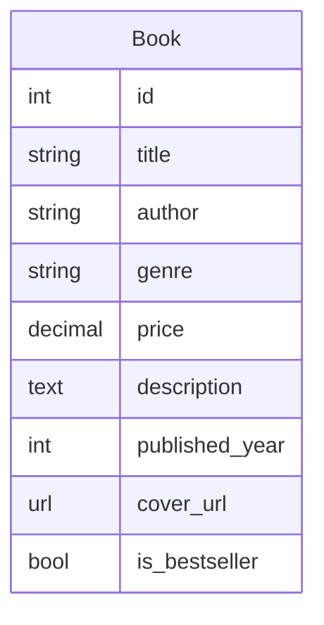
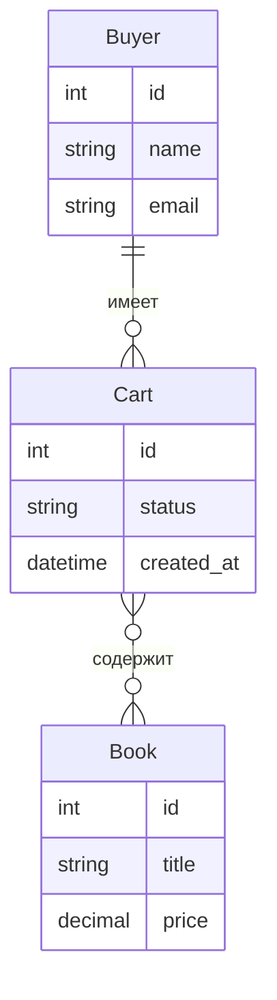
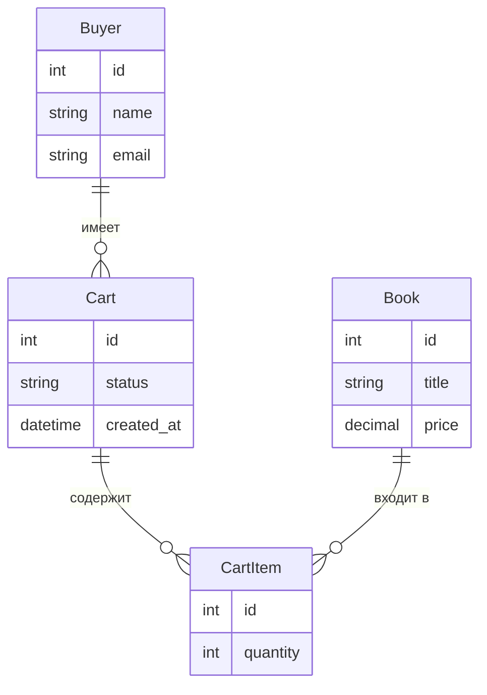
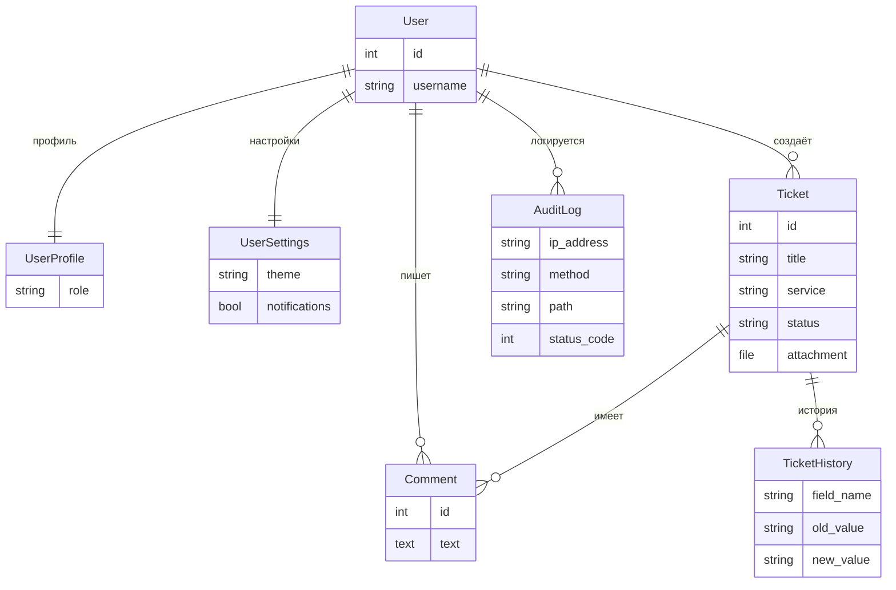

## Запуск лабораторных

**Лаба 1** (порт 8001):
  ```powershell
  cd Lab1; ..\.venv\Scripts\python.exe manage.py runserver 8001
  ```

**Лаба 2** (порт 8002):
  ```powershell
  cd Lab2; ..\.venv\Scripts\python.exe manage.py runserver 8002
  ```

**Лаба 3** (порт 8003):
  ```powershell
  cd Lab3; ..\.venv\Scripts\python.exe manage.py runserver 8003
  ```

**Лаба 4** (порт 8004):
  ```powershell
  cd Lab4; ..\.venv\Scripts\python.exe manage.py runserver 8004
  ```


---

## Лаба 1 — Каталог книг

Сделал мини-сайт каталога книг. Одна модель — Книга (название, автор, жанр, цена, описание, год, обложка). Данные в SQLite, на странице книги выводятся сеткой в три колонки. Если у книги нет картинки обложки — рисуется красивая CSS-заглушка с градиентом.

Шаблоны используют наследование: есть базовый шаблон, от него расширяется страница каталога через ``.

Из **встроенных** тегов и фильтров применил четыре штуки: перевод в верхний регистр, заглавная первая буква, значение по умолчанию и обрезка текста до 20 слов.

**Кастомных** написал три:
- Форматирование цены — чтобы выводилось «1 200,00 ₽» с пробелами.
- Проверка новинки — если книга издана за последние 3 года, рендерится бейдж «Новинка».
- Время чтения — считает слова в описании и прикидывает, сколько минут читать.



---

## Лаба 2 — Корзина и покупатели

Добавил три сущности: **Покупатель**, **Товар** (это те же книги) и **Корзина**. Корзина привязана к покупателю через ForeignKey, а с книгами связана через ManyToMany.

В **админке** настроил: вывод количества товаров в каждой корзине (вычисляемое поле), поиск по имени и почте покупателя через связанную таблицу, фильтрацию по статусу и дате.

На сайте сделал страницу `/carts/` — таблица со всеми корзинами, данными покупателя, списком книг и итоговой суммой.



---

## Лаба 3 — Количество товаров и инлайны

Главное изменение — теперь у каждой книги в корзине есть **количество**. Для этого заменил обычную связь ManyToMany на **промежуточную модель** с параметром `through`. У неё три поля: корзина, книга и количество. Без неё нельзя — обычная M2M-связь хранит только два ID, а нам нужно ещё и количество.

В **админке** добавил инлайн-редактирование — прямо в карточке корзины видна табличка с книгами, можно менять количество, добавлять и удалять позиции.

Появились два **вычисляемых поля** в списке корзин: общее количество единиц и итоговая стоимость (цена × количество по каждой позиции, потом сумма). Оба считаются в доменном слое, не SQL-запросом.

Ещё добавил навигацию по датам в админке и визуальное приглушение неактивных корзин на сайте (полупрозрачность через CSS). Статусы в админке выделяются цветными бейджами.

Для оптимизации использую `prefetch_related` — без него Django делал бы по запросу на товары каждой корзины (проблема N+1), а так всего два запроса на всё.



---

## Лаба 4 — Портал заявок и Middleware

Отдельное приложение — корпоративный портал заявок. Сотрудники создают заявки на услуги (IT, ремонт, бухгалтерия), прикладывают файлы, оставляют комментарии, меняют статус.

**Шесть моделей:** заявка, комментарий, история изменений (автоматически пишется что поменялось), профиль пользователя с ролью, пользовательские настройки и журнал аудита.

**Три роли:** пользователь, модератор, администратор. Права зависят от роли — например, автор может править свою заявку только если она в статусе «Новая» и прошло меньше двух часов.

Кроме обычных HTML-страниц, есть **REST API** — два эндпоинта, которые отдают данные в JSON.

Основная тема лабы — **пять Middleware** (промежуточные обработчики, работают как конвейер — запрос проходит через них по очереди):

1. **Request ID** — каждому запросу присваивается уникальный идентификатор для отладки.
2. **Аудит** — пишет в базу кто зашёл, откуда, каким браузером, на какую страницу и что получил в ответ.
3. **Лимит запросов** — если с одного IP слишком много запросов за минуту, блокирует с ошибкой 429.
4. **Автологин** — для удобства тестирования, если не авторизован — автоматически заходит как демо-пользователь.
5. **Рабочие часы** — запрещает создание и изменение заявок вне рабочего времени (до 9, после 18, в выходные). Админов не трогает.


