# Zenith Academy: Низкоуровневая разработка на практике

Добро пожаловать в практическое руководство по низкоуровневой разработке.

Если ты здесь, значит, тебя интересует нечто большее, чем стандартные веб-формы и перекладывание JSON-ов. Ты хочешь создавать миры, выжимать максимум из видеокарты и понимать, как процессор работает с каждым битом в оперативной памяти.

Это — **Zenith Academy**.

---

## 🐣 Порог входа: Кого мы ждем?

**Zenith Academy** — это не курс для тех, кто видит программирование первый раз в жизни. Если ты ни разу не писал `int x = 5` или не знаешь, как устроен цикл `for`, тебе будет крайне сложно.

**Наши требования на входе:**
* Базовое понимание синтаксиса Java (переменные, типы данных, циклы, массивы, простые классы и методы).
* Опыт написания хотя бы 1-2 простейших консольных приложений или простейших 2D-игр.
* Жгучее желание залезть под капот виртуальной машины и физического кремния, чтобы выжать максимум производительности.

Если ты соответствуешь этим требованиям — добро пожаловать! Ты получишь колоссальную практическую ценность. Если нет — рекомендуем сначала написать пару простых программ на Java, а затем возвращаться сюда.

---

## 🛠️ Сквозная практика: Почувствуй боль руками

Мы убеждены, что теория без практики мертва. Прочитать про MESI-протокол или Branch Prediction и не пощупать их руками — значит забыть всё через неделю.

Поэтому в конце ключевых глав тебя ждут **интерактивные практические задачи на Java**:
1. Мы закладываем «боль» в специальный класс-заготовку в проекте (в пакете `com.za.zenith.academy`).
2. Ты открываешь этот класс в своей IDE, запускаешь встроенный бенчмарк и видишь, как сильно тормозит некорректный код.
3. Ты исправляешь его по инструкциям с портала, перезапускаешь тест и видишь прирост скорости в разы!
4. В конце главы тебя также ждет **квиз из 5–6 вопросов**, проверяющий не просто память, а глубокое понимание концепций.

---

## О чём этот курс

Большинство программистов ездят на общественном транспорте. Они используют готовые фреймворки, тяжелые движки (Unity, Unreal) и не задумываются, что происходит внутри. Это нормально и безопасно.

Здесь мы — **автомеханики гоночных болидов**. Мы собираем собственный высокопроизводительный воксельный движок **Zenith** с нуля. Перебираем двигатель (JVM — виртуальную машину Java) до последнего винтика, настраиваем впрыск топлива (VRAM — видеопамять) и выжимаем 144 FPS (кадров в секунду) без единого микрофриза.

Учебник построен на примере реального кода Zenith — воксельной RPG. Никакой сухой научной нудятины или формул без объяснений. Все темы разобраны подробно, с живыми примерами и аналогиями из реальной жизни.

Изучив эти материалы, ты разберёшься в устройстве движка и получишь знания, достаточные для прохождения технических собеседований уровня **Middle+ / Senior Java & Graphics Engineer** с глубоким пониманием работы «железа».

---

## Содержание курса (Главы)

Учебник разбит на 11 специализированных глав. Вот что в них рассматривается:

### 🐣 [[0. Алгоритмы для начинающих|Глава 0. Основы программирования и алгоритмов "На пальцах"]].
* **Простыми словами:** Спасательный круг для тех, кто плохо знаком с алгоритмами и структурами данных. 
* **Живая метафора:** Использование множеств (HashSet) как мешка для отбрасывания одинаковых яблок, массивы как шкафчики, а алгоритм BFS как круги на воде от брошенного камня.
* **Чему научимся:** Понимать сложность Big O, использовать `keys[keyId] = true` для доступа за $O(1)$, и знать на пальцах, как работают Raycast и Frustum Culling.

### 📦 [[1. JVM и Память|Глава 1. Управление памятью JVM & Стратегия Zero-Allocation]])
* **Простыми словами:** Разбираемся, как устроена память под капотом Java.
* **Живая метафора:** Стопка тарелок на кухне (**Стек**) против детской комнаты, заваленной раскиданными игрушками (**Куча**). Почему строгая мама (**Сборщик Мусора**) кричит *«Stop the World!»* и останавливает нашу игру.
* **Чему научимся:** Писать код с нулевым выделением памяти, упаковывать 3D-координаты в примитивные числа `long` битовыми сдвигами и дружить с кэшем процессора.

### 🖥️ [[2. Конвейер OpenGL|Глава 2. Графический конвейер OpenGL & Системные вызовы]]
* **Простыми словами:** Как подружить наш центральный процессор (CPU) с видеокартой (GPU) и заставить их работать на пределе возможностей.
* **Живая метафора:** Видеокарта как огромный автоматический завод. Процессор — ленивый директор, который делает медленные телефонные звонки (**Draw Calls**). Как отправить на завод огромную фуру с кирпичами (**VBO** — буфер вершинных данных), таможенную накладную (**VAO** — объект, описывающий структуру этих данных) и запустить роботов-маляров (**шейдеры**).
* **Чему научимся:** Низкоуровневой работе с графикой в LWJGL 3 (Lightweight Java Game Library), устранению бутылочного горлышка системных вызовов и созданию шейдеров.

### 🚀 [[3. GPU-Driven Rendering|Глава 3. GPU-Driven Rendering & Оптимизация VRAM]]
* **Простыми словами:** Полная автоматизация рендеринга. Убираем CPU из цепочки отрисовки и отдаем всю власть видеокарте.
* **Живая метафора:** Директор больше не звонит рабочим на завод лично. Он один раз пишет толстую книгу с планом работ (**Indirect Buffer**), и завод собирает миллионы объектов за раз (**MultiDraw Indirect** — отрисовка множества объектов за один вызов).
* **Чему научимся:** Архитектуре Mesh Pooling на общем гигантском «складе» VRAM, алгоритмам Connected Textures и умному расчету гладкого света без мигания граней.

### 📐 [[4. Процедурная физика и Математика|Глава 4. Процедурная физика, Линейная алгебра & IK]]
* **Простыми словами:** Математика без страха и слёз. Векторы, матрицы и скелетная анимация на пальцах.
* **Живая метафора:** Симуляция пружины как *«грузик на резинке в банке с густым мёдом»*. Вращение костей рук кватернионами как «умными сферическими шарнирами». Сборка скелета персонажа методом бусин на веревочке (**FABRIK IK**).
* **Чему научимся:** Уравнениям пружины-массы-демпфера, плавной интерполяции Lerp/Slerp (линейная и сферическая интерполяция), автоориентации текстур через PCA (метод главных компонент) и инверсной кинематике рук/ног персонажа.

### ⚡ [[5. Event-Driven архитектура|Глава 5. Реактивная шина событий & Архитектура ввода]]
* **Простыми словами:** Как избавить код от кучи запутанных связей (спагетти-кода) и сделать архитектуру независимой и расширяемой.
* **Живая метафора:** Городская доска объявлений (**EventBus**). Персонаж вешает записку: *«Я нанёс удар!»*, а контроллеры видят её и рассчитывают урон. Никто ни с кем не общается напрямую!
* **Чему научимся:** Созданию Zero-Alloc шины событий, обработке нажатий клавиш на плоских битовых масках и процедурным слабым точкам (Weak Spots) при добыче блоков.

### 🎨 [[6. UI и Рендеринг шрифтов|Глава 6. Рендеринг интерфейсов & Шейдерная анимация шрифтов]]
* **Простыми словами:** Как рисовать красивые меню, окна и заставить буквы на экране эффектно двигаться.
* **Живая метафора:** Обрезка прокручиваемых списков (**glScissor**) как трафаретная картонная маска. Использование школьных синусов и косинусов для анимации букв.
* **Чему научимся:** Рисованию адаптивных UI интерфейсов на JSON, решению проблемы с переворотом систем координат OpenGL и шейдерным эффектам текста (Rainbow, Glow, Wave, Shake).

### 🧵 [[7. Многопоточность|Глава 7. Асинхронные вычисления & Многопоточность]]
* **Простыми словами:** Запрягаем все ядра процессора работать вместе и следим, чтобы они не поубивали друг друга.
* **Живая метафора:** Потоки как бригада строителей. **Состояние гонки (Data Race)** как два строителя, одновременно пытающиеся писать в один и тот же блокнот. 
* **Чему научимся:** Асинхронной генерации чанков по спирали в фоне, потокобезопасному расчету освещения в `LightEngine` и защите палитры чанка от повреждений с помощью Lock-Free трюков.

### ⚔️ [Глава 9. RPG-система, Генератор Лута & Лингвистический Движок](chapter_9_rpg_and_loot_generation.md)
* **Простыми словами:** Создаем глубокую RPG-систему на 100% Data-Driven рельсах и учим игру говорить на чистом русском языке без машинного кринжа.
* **Живая метафора:** Таблицы лута как колесо фортуны с секторами разной ширины (весами). Лингвистический движок как конструктор Lego, меняющий стыковочные детали под род слова.
* **Чему научимся:** Реестрам статов и редкостей, процедурному выпадению лута по весам, бесконечной автогенерации предметов с префиксами и суффиксами и согласованию окончаний прилагательных по родам в русском языке.

### 🧲 [Глава 10. Физический Viewmodel, 3D-пикинг костей (Ray-OBB) & Магнитный Лут](chapter_10_viewmodel_physics_and_magnetism.md)
* **Простыми словами:** Трехмерные клики в пустом пространстве, раскаленные докрасна руки и притягивание лута магнитом.
* **Живая метафора:** Ray-OBB локализация лучом — «мысленно крутим всю вселенную вокруг неподвижной коробки вместо поворота самой коробки». Физическое упреждение Lead Pursuit как бег наперерез уходящему автобусу. Раскаление Mining Heat как лампа накаливания.
* **Чему научимся:** Переводу 2D мыши в 3D луч и кликам по Oriented Bounding Box (ориентированному ограничивающему параллелепипеду) через локальное AABB (ось-выровненный параллелепипед) и `globalMatrix.invert()`. Физике упреждающего магнитного притяжения предметов с учетом скорости игрока. Изолированному нагреву костяшек рук и рабочей части инструментов.

### 🏆 [Глава 8. Шпаргалка для IT-собеседований (Senior Cheat Sheet)](chapter_8_interview_cheat_sheet.md)
* **Простыми словами:** Компактная шпаргалка для подготовки к техническим собеседованиям.
* **Чему научимся:** Как грамотно описать проект Zenith в резюме и как отвечать на 20 каверзных вопросов с собеседований, опираясь на реальный код — с глубоким пониманием работы железа, но без заумной воды.

---

## 🏎️ Логика маршрута (The Grand Design)

Наш курс — это не случайный набор статей. Это единый, математически выверенный инженерный маршрут, где каждая следующая глава логически вытекает из предыдущей, решая её проблемы:

```mermaid
graph TD
    Z["Глава 0. Базовые алгоритмы<br>(Для новичков)"]
    Z -->|"Основы понятны"| A["Глава 1. Память JVM<br>(Закладываем Zero-Alloc фундамент на CPU)"]
    A -->|"Память готова. Как вывести картинку?"| B["Глава 2. OpenGL Конвейер<br>(Упираемся в лимит Draw Calls)"]
    B -->|"Решаем CPU Bottleneck автоматизацией"| C["Глава 3. GPU-Driven Rendering<br>(Мир рендерится. Но он мертв и статичен)"]
    C -->|"Оживляем мир физикой и анимациями"| D["Глава 4. Физика & Математика<br>(IK, Пружины. Как связать это с вводом?)" ]
    D -->|"Изолируем ввод от геймплея шиной"| E["Глава 5. Реактивный ввод & EventBus<br>(Игра работает. Нужна обратная связь)"]
    E -->|"Строим интерфейсы на GPU"| F["Глава 6. UI & Шейдерный Текст<br>(Один чанк летает. Но мир бесконечен)"]
    F -->|"Уносим генерацию в фоновые потоки"| G["Глава 7. Асинхронность & Потоки<br>(Движок летает. Как сделать глубокую RPG?)"]
    G -->|"Интегрируем статы и лутбоксы в мир"| I["Глава 9. RPG-система & Генератор Лута<br>(Лут генерируется. Добавим 3D интерактив)"]
    I -->|"Внедряем 3D пикинг OBB и магнитный сбор"| J["Глава 10. Физика Viewmodel & Магнитный Лут<br>(Движок полностью готов. Выходим на рынок)"]
    J -->|"Упаковываем опыт в резюме"| H["Глава 8. Свиток собеседований<br>(Побеждаем в BigTech)"]

    style Z fill:#1e1e2e,stroke:#a6e3a1,stroke-width:2px,color:#cdd6f4
    style A fill:#1e1e2e,stroke:#313244,stroke-width:2px,color:#cdd6f4
    style B fill:#1e1e2e,stroke:#313244,stroke-width:2px,color:#cdd6f4
    style C fill:#1e1e2e,stroke:#313244,stroke-width:2px,color:#cdd6f4
    style D fill:#1e1e2e,stroke:#313244,stroke-width:2px,color:#cdd6f4
    style E fill:#1e1e2e,stroke:#313244,stroke-width:2px,color:#cdd6f4
    style F fill:#1e1e2e,stroke:#313244,stroke-width:2px,color:#cdd6f4
    style G fill:#1e1e2e,stroke:#313244,stroke-width:2px,color:#cdd6f4
    style I fill:#1e1e2e,stroke:#313244,stroke-width:2px,color:#cdd6f4
    style J fill:#1e1e2e,stroke:#313244,stroke-width:2px,color:#cdd6f4
    style H fill:#f9e2af,stroke:#fab387,stroke-width:2px,color:#11111b
```

1. **Глава 0 (Алгоритмы)**: Вводная глава для новичков. Если знаете Big O, массивы и словари — можете смело пропускать.
2. **Глава 1 (Память)**: Если мы не научим JVM не мусорить в память (Zero-Allocation), то любые графические конвейеры в последующих главах будут заикаться из-за GC-пауз (пауз Сборщика Мусора). Сначала настраиваем "мозг" и память на CPU.
3. **Глава 2 (OpenGL)**: Память готова. Мы хотим вывести картинку. Мы переносим данные на GPU и учим его рисовать. Но классический подход заставляет процессор делать тысячи звонков (Draw Calls), упираясь в PCIe шину (высокоскоростную шину передачи данных) (CPU Bottleneck).
3. **Глава 3 (GPU-Driven)**: Мы решаем проблему Draw Calls, отдав управление самой видеокарте через Mesh Pooling и MultiDraw Indirect. Картинка летает со скоростью 300 FPS! Но мир мертв — блоки стоят неподвижно, рук и анимаций нет.
4. **Глава 4 (Физика и Математика)**: Оживляем персонажа! Внедряем пружинную физику для рук, кватернионы для суставов костей, PCA для правильного хвата предметов и инверсную кинематику FABRIK. Но как связать клики игрока с этой физикой, не превратив код в кашу?
5. **Глава 5 (Event-Driven)**: Мы изолируем обработку ввода от геймплейных механик с помощью шины событий EventBus и битовых масок. Теперь клики вешают записочки на доску, а физика и мир реагируют на них.
6. **Глава 6 (UI и Текст)**: Персонаж ломает блоки, собирает лут и бегает по миру. Но ему нужен интерфейс (HUD — интерфейс поверх экрана, инвентарь, Дневник Выжившего). Мы строим быстрый UI на базе `glScissor` и анимируем текст математическими синусами в шейдере.
7. **Глава 7 (Многопоточность)**: Игра полностью работает в пределах одного чанка. Но стоит игроку побежать по бескрайнему миру, как генерация новых блоков и BFS-свет (освещение на основе поиска в ширину) вешают игру. Мы распараллеливаем вычисления на бригаду строителей (асинхронные потоки), защищая данные Lock-Free (безблокировочными) трюками.
8. **Глава 9 (RPG и Лут)**: Движок летает и генерирует бесконечный мир. Но без ролевых механик в нем нечего делать. Мы строим 100% Data-Driven систему статов, весовые таблицы дропа и уникальный лингвистический генератор для красивого русского языка.
9. **Глава 10 (Viewmodel и Магнетизм)**: Связываем RPG-систему, графику и физику воедино. Делаем клики по 3D-костям Oriented Bounding Box через инверсию матриц, сочное упреждающее преследование магнитного лута к игроку и локализованный шейдерный прогрев рук.
10. **Глава 8 (Собеседования)**: Движок готов. Собираем все низкоуровневые знания в резюме и разбираем типичные вопросы BigTech-собеседований.

---

## Как эффективно учиться в Zenith Academy?

1. **Используй интерактивный портал:** Читай главы в веб-интерфейсе, проходи квизы в конце каждой главы — они помогут закрепить понимание и выявить пробелы.
2. **Экспериментируй в Лаборатории:** Во вкладке **«Лаборатория»** в боковом меню есть интерактивные песочницы: Spring Simulator, Vertex Compressor, настройки шейдеров текста. Пощупать формулы руками — лучший способ их понять.
3. **Открывай код в IDE:** Открывай реальные классы Zenith, ставь точки останова (breakpoints) в методах рендеринга и физики — смотри, как данные текут по системе.
4. **Проговаривай ответы вслух:** Разделы собеседований в конце глав — отличный тренажёр. Попробуй объяснить ответ простыми словами (хоть коту, хоть резиновой уточке). Если получилось — материал усвоен.

Начинай с **[Главы 0](chapter_0_algorithms_for_beginners.md)** (если нужно подтянуть основы) или сразу с **[Главы 1](chapter_1_jvm_and_memory.md)** — там закладывается фундамент всей архитектуры.
