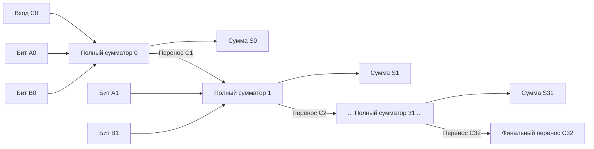

# Глава 0. От кремния к транзистору: Как рождается цифровая логика

> [!NOTE]
> **TL;DR:** Процессор — это не абстрактная математическая коробка, а сложнейший физический кристалл кремния, управляющий потоками электронов. В этой главе мы разберем путь с самого низа: от очищенного песка и легирования полупроводников до полевых транзисторов и логических вентилей КМОП, которые из электрических зарядов создают цифровую логику "да" и "нет".

---

### ⚡ БОЛЬ: Закон Мура замедляется, а процессоры плавятся
Десятилетиями программисты наслаждались "халявным" приростом скорости: каждые 18 месяцев транзисторы уменьшались в размерах, а тактовая частота росла сама по себе (Закон Мура и масштабирование Деннарда). Можно было писать неоптимальный код, зная, что следующее поколение CPU всё исправит. 

Но в районе 2004 года физика нанесла ответный удар. Мы уперлись в **тепловой барьер (Thermal Wall)**: толщина затворов транзисторов приблизилась к размерам нескольких атомов, и токи квантового туннелирования (утечки) стали огромными. Если бы частота продолжала расти теми же темпами, чипы выделяли бы больше тепла на квадратный сантиметр, чем сопло ракетного двигателя. Рост однопоточной частоты замер в районе 4-5 ГГц.

**Решение:** Современная индустрия разработки высокопроизводительных систем (таких как воксельный 3D-движок **Zenith**) больше не может полагаться на абстракции. Единственный способ выжать 240 FPS — проектировать программные архитектуры, которые идеально ложатся на физические законы работы полупроводников, кэшей и шин данных. Эта глава — твой фундамент понимания ограничений физического мира.

---

## 1. Физика полупроводников: От кремния к транзистору

Чтобы понять, как кремний стал сердцем цифровой революции, нам не нужно быть профессиональными физиками-химиками. Нам достаточно понять базовый физический принцип: как вещество может превращаться из идеального изолятора в идеальный проводник с помощью электрического поля.

### Почему именно кремний?
Кремний ($Si$) — это элемент IV группы таблицы Менделеева. Это значит, что у него на внешней оболочке есть **4 валентных электрона**. В кристаллической решетке чистейшего кремния каждый атом прочно связан ковалентными связями со своими соседями. Все электроны заняты делом — они удерживают кристаллическую структуру. Свободных носителей заряда нет. Поэтому чистый кремний при низких температурах ведет себя как диэлектрик (изолятор) — он не проводит электрический ток.

Но как заставить его проводить ток, причем управляемо? С помощью легирования.

### Легирование кремния: n-тип и p-тип
Чтобы кремний приобрел нужные нам свойства, в его идеальную кристаллическую решетку внедряют микроскопические примеси других элементов. Этот процесс называется **легированием** (doping). В зависимости от типа примеси мы получаем два противоположных типа проводимости:

#### n-тип (Negative — Электронный)
Если мы внедрим в решетку кремния атомы V группы (например, **фосфор** или **мышьяк**), у которых **5 валентных электронов**:
* Четыре электрона образуют связи с соседними атомами кремния.
* Пятый электрон оказывается «лишним» и слабо удерживается ядром. При комнатной температуре тепловой энергии достаточно, чтобы этот электрон оторвался и стал свободным.
* Основным носителем заряда в таком полупроводнике становятся свободные отрицательные **электроны** ($e^-$).

#### p-тип (Positive — Дырочный)
Если мы внедрим атомы III группы (например, **бор** или **индий**), у которых всего **3 валентных электрона**:
* Для полной связи с четырьмя соседями-кремнием не хватает одного электрона.
* Бор захватывает недостающий электрон у соседнего кремния, создавая вакантное место — **дырку** ($h^+$).
* Эта вакансия может свободно «перемещаться» по кристаллу (соседний электрон перескакивает в дырку, создавая новую дырку на своем старом месте). В физике дырка рассматривается как полноценная подвижная частица с положительным зарядом.

```
       Полупроводник n-типа              Полупроводник p-типа
       (Свободные электроны)             (Подвижные дырки-вакансии)
         |     |     |                     |     |     |
      ── Si ── Si ── Si ──              ── Si ── Si ── Si ──
         |     |     |                     |     |     |
      ── Si ──  P  ── Si ──             ── Si ──  B  ── Si ──
         |    / \    |                     |    / \    |
         |  [e-] \   |                     |  [h+] \   |
      ── Si ── Si ── Si ──              ── Si ── Si ── Si ──
         |     |     |                     |     |     |
```

Создав области с избытком электронов ($n$-тип) и дырок ($p$-тип) на одной кремниевой пластине с помощью нанометровой фотолитографии, мы получаем возможность строить управляемые электрические ключи — **транзисторы**.

---

## 2. P-N переход и физика MOSFET-транзистора

### Физика P-N перехода: Односторонний барьер

Если физически соединить полупроводники p-типа и n-типа в одном кристалле, на границе раздела возникнет уникальное явление — **p-n переход**:

1. **Диффузия**: Из-за гигантского градиента концентраций электроны из n-области лавиной устремляются в p-область, а дырки из p-области диффундируют в n-область.
2. **Рекомбинация**: Встречаясь на границе перехода, электроны заполняют дырки (происходит рекомбинация).
3. **Образование пространственного заряда**: 
   * Уходя из пограничной зоны n-области, электроны оставляют за собой нескомпенсированные положительные ионы доноров (фосфора).
   * Дырки, покидая пограничную зону p-области, оставляют отрицательные ионы акцепторов (бора).
   * Ионы жестко вшиты в кристаллическую решетку и двигаться не могут. На границе раздела образуется двойной слой зарядов противоположного знака.
4. **Внутреннее поле и равновесие**: Этот двойной слой создает внутреннее электрическое поле $\vec{E}_{int}$, направленное от n-области к p-области. Поле препятствует дальнейшей диффузии: оно толкает электроны обратно в n-область, а дырки — в p-область. Когда сила поля уравновешивает силу диффузии, процесс останавливается.
5. **Обедненная зона (Depletion Region)**: Область вблизи границы раздела шириной порядка нескольких микрометров (или нанометров в современных чипах) оказывается практически очищенной от свободных носителей заряда (электронов и дырок), которые выметаются внутренним полем. Эта зона обладает колоссальным электрическим сопротивлением и представляет собой потенциальный барьер.

```
       p-область (дырки +)                 n-область (электроны -)
   ============================       ============================
  |   +    +    +   [ Бор- ]   |     |   [ Фосф+ ]   -    -    -   |
  |   +    +    +   [ Бор- ]   |  E  |   [ Фосф+ ]   -    -    -   |
  |   +    +    +   [ Бор- ]   |<====|   [ Фосф+ ]   -    -    -   |
   ============================       ============================
                 ▲                                 ▲
                 │                                 │
                 └──────── Обедненная зона ────────┘
                      (Высокое сопротивление)
```

При подаче внешнего напряжения возможны два режима:

* **Обратное смещение**: Мы подключаем плюс источника к n-области, а минус — к p-области. Внешнее поле $\vec{E}_{ext}$ сонаправлено с внутренним полем $\vec{E}_{int}$. Оно растаскивает подвижные носители от границы раздела вглубь полупроводников, расширяя обедненную зону. Потенциальный барьер увеличивается. Ток через переход равен нулю (за исключением пренебрежимо малого дрейфового тока неосновных носителей). Переход **закрыт**.
* **Прямое смещение**: Мы подключаем плюс источника к p-области, а минус — к n-области. Внешнее поле $\vec{E}_{ext}$ направлено навстречу внутреннему $\vec{E}_{int}$. Когда внешнее напряжение превышает высоту потенциального барьера (для кремния это около 0.6–0.7 В), обедненная зона сжимается до нуля. Свободные носители лавиной преодолевают границу перехода. Через диод течет мощный ток. Переход **открыт**.

---

### Физика MOSFET транзистора

Диод — это неуправляемый вентиль. Чтобы получить управляемый ключ, способный коммутировать токи по команде, необходим третий, управляющий электрод. В современной цифровой схемотехнике эту роль выполняет полевой транзистор со структурой Металл-Оксид-Полупроводник (**MOSFET**).

В процессорах используются транзисторы двух комплементарных типов: **n-канальные (NMOS)** и **p-канальные (PMOS)**.

#### Устройство NMOS-транзистора:
Основой транзистора служит кремниевая подложка p-типа. В ней методом ионной имплантации создаются две изолированные области с высокой концентрацией донорных примесей ($n^+$) — **Исток (Source)** и **Сток (Drain)**. 

Пространство между ними называют **каналом**. Прямо над областью канала располагается управляющий электрод — **Затвор (Gate)**. Он физически изолирован от канала тончайшим слоем диэлектрика.

```
                      Затвор (Gate) [Металл/Поликремний]
                            ┌───────────┐
                            │  Z A T V  │
                            └─────┬─────┘
                ──────────────────┴──────────────────
               |  Диэлектрик (High-k / HfO2)         |  <-- Изолятор
  ───────────────────────────────────────────────────────────────────
 [ Исток (Source) ] (n+)    | Канал (p-тип) |    [ Сток (Drain) ] (n+)
  ──────────────────────────|               |────────────────────────
                            | Подложка (p)  |
                            └───────────────┘
```

> [!NOTE]
> **Физика диэлектрика затвора: От SiO2 к High-k**:
> Исторически диэлектриком служил оксид кремния $SiO_2$. С уменьшением размеров транзисторов толщина слоя оксида упала до критических 1–1.2 нм (всего 4–5 слоев атомов!). На этом масштабе электроны начали квантово туннелировать (совершать квантовый «телепортационный» переход) сквозь изолятор, создавая огромные токи утечки затвора. 
> 
> Начиная с 45-нм техпроцесса (Intel, 2007 г.), диэлектрик заменили на материалы с высоким показателем диэлектрической проницаемости (**High-k**, на основе оксидов гафния $HfO_2$). Физический смысл прост: материал с высоким $k$ позволяет сделать изолирующий слой физически более толстым (что полностью блокирует туннельные утечки), сохраняя при этом ту же электростатическую емкость затвора и способность управлять каналом с помощью электрического поля.

#### Механизм работы NMOS-транзистора:

1. **Закрытое состояние ($V_{GS} < V_{th}$)**:
   При нулевом или низком напряжении на затворе между Истоком ($n^+$) и Стоком ($n^+$) лежит подложка p-типа. Исток и Сток изолированы друг от друга встречно-последовательными p-n переходами. Ток течь не может, сопротивление стремится к гигаомам.
2. **Формирование канала и инверсия проводимости ($V_{GS} \ge V_{th}$)**:
   Когда мы подаем на затвор положительный потенциал относительно истока, на затворе накапливается положительный заряд. Он создает электрическое поле, проникающее сквозь диэлектрик вглубь p-подложки. 
   
   Поле начинает выталкивать положительные дырки из приповерхностного слоя подложки вглубь кристалла. Приповерхностный слой обедняется. При достижении порогового напряжения ($V_{th}$, обычно около 0.3–0.4 В) поле затвора начинает активно притягивать свободные электроны (которые являются неосновными носителями в p-подложке и легко диффундируют из областей истока и стока) к границе с диэлектриком.
   
   У поверхности кремния концентрация электронов превышает концентрацию дырок. Происходит квантово-физический переход — **инверсия проводимости**. Тонкий слой p-подложки под затвором временно меняет свой тип проводимости на n-тип. Образуется непрерывный проводящий **n-канал**, соединяющий исток и сток. Сопротивление падает до долей ома. Теперь при подаче напряжения $V_{DS}$ электроны начинают двигаться от Истока к Стоку (а ток условно течет от Стока к Истоку).

#### Устройство PMOS-транзистора:
PMOS устроен зеркально: подложкой служит кремний n-типа, Исток и Сток легированы акцепторами ($p^+$), а для открытия транзистора на затвор нужно подать **отрицательное напряжение** относительно истока ($V_{GS} < 0$). Электрическое поле затвора выталкивает электроны из приповерхностной зоны n-подложки и притягивает дырки, образуя проводящий p-канал.

---

### Аналогия с водяным клапаном

Поведение полевого транзистора идеально иллюстрируется механическим водяным клапаном (смесителем).

Представим герметичную трубу с водой под давлением:

```
               [ Напряжение затвора (Давление на шток) ]
                                 │
                                 ▼
                           ┌───────────┐
                           │   Шток    │
                           └─────┬─────┘
                                 │  [Пружина] (Пороговое напряжение Vth)
                                 ▼
                     =======================
    [ Источник ] ===>|   Эластичный рукав   |===> [ Слив ]
     (Source)        |   (Область канала)   |      (Drain)
                     =======================
```

Давай сопоставим элементы физического транзистора NMOS и водяного клапана:

| Элемент MOSFET | Аналог в водяном клапане | Физический смысл |
| :--- | :--- | :--- |
| **Исток (Source)** | **Входной патрубок** | Резервуар с водой под высоким давлением (источник электронов). |
| **Сток (Drain)** | **Сливной патрубок** | Труба слива, ведущая в зону пониженного давления. |
| **Область канала** | **Эластичный резиновый рукав** | Проводящий тракт. В покое рукав пережат внешней пружиной (встречные p-n переходы перекрывают путь). |
| **Затвор (Gate)** | **Шток управления с мембраной** | Управляющий элемент, не контактирующий с водой напрямую (изолирован мембраной/диэлектриком). |
| **Напряжение затвора $V_{GS}$** | **Давление руки на шток** | Сила, с которой мы давим на управляющий механизм. |
| **Пороговое напряжение $V_{th}$** | **Жесткость возвратной пружины** | Минимальная сила давления, необходимая, чтобы преодолеть сопротивление пружины и начать сдвигать перекрывающий шток. |

* **Клапан закрыт**: Мы не давим на шток ($V_{GS} = 0$). Пружина жестко прижимает шток к эластичному рукаву. Вода заперта на входе (электроны не могут преодолеть барьер). На сливе сухо (ток равен 0).
* **Клапан открыт**: Мы давим на шток с силой, преодолевающей пружину ($V_{GS} > V_{th}$). Шток поднимается, освобождая эластичный рукав. Рукав распрямляется, формируя свободный проход (инверсионный канал). Вода под действием разницы давлений ($V_{DS}$) лавиной устремляется из входного патрубка в сливной.

---

## 3. КМОП-технология (CMOS): Архитектура нулевого потребления

В ранней цифровой технике (1970-е годы) использовалась **NMOS-логика**, где логические вентили состояли только из NMOS-транзисторов, дополненных нагрузочными резисторами (или транзисторами в режиме постоянной проводимости).

Эта схема обладала фатальным архитектурным дефектом:

```
                  +Vcc (Питание)
                       │
                     [ R ]  Нагрузочный резистор
                       │
                       ├───── Выход (Y)
                     ┌─┴─┐
             In ────┤ N ├   NMOS-транзистор
                     └─┬─┘
                       │
                      GND
```

Когда на входе `In` была логическая `1`, NMOS-транзистор открывался, притягивая выход `Y` к земле (GND) — на выходе формировался `0`. Однако при этом открывался прямой путь для протекания постоянного тока от шины питания $+V_{cc}$ через резистор $R$ и открытый транзистор на землю. 

Процессоры потребляли мегаватты энергии и выделяли колоссальное количество тепла, даже когда компьютер просто простаивал и не совершал никаких вычислений.

Решением стала технология **КМОП** (Комплементарная структура Металл-Оксид-Полупроводник, или **CMOS**). Её гениальная суть заключается в использовании взаимодополняющих (комплементарных) пар транзисторов разного типа проводимости — NMOS и PMOS, управляемых синхронно:

```
                  +Vcc (Питание, 1)
                      │
                    ┌─┴─┐
              ┌────┤ P ├ (PMOS - открывается логическим 0)
              │     └─┬─┘
  Вход (In) ──┤       ├─── Выход (Out)
              │     ┌─┴─┐
              └────┤ N ├ (NMOS - открывается логической 1)
                    └─┬─┘
                      │
                     GND (Земля, 0)
```

Для понимания новичками, давайте наглядно визуализируем, как течет ток в обоих состояниях:

```
[Состояние 1: Вход In = 0 (Логический "0")]
                  +Vcc (Питание, 1)
                      │
                 ┌─────────┐
                 │  PMOS   │ <=== ОТКРЫТ (Ток свободно течет от питания)
                 └────┬────┘
                      │
                      ├───────────────> Выход Out = 1 (Высокий уровень, +Vcc)
                      │
                 ░░░░░░░░░░░
                 ░  NMOS   ░ <=== ЗАКРЫТ (Путь тока на землю полностью заблокирован!)
                 ░░░░░░░░░░░
                      │
                     GND (Земля, 0)
```

```
[Состояние 2: Вход In = 1 (Логическая "1")]
                  +Vcc (Питание, 1)
                      │
                 ░░░░░░░░░░░
                 ░  PMOS   ░ <=== ЗАКРЫТ (Путь тока от питания заблокирован!)
                 ░░░░░░░░░░░
                      │
                      ├───────────────> Выход Out = 0 (Притянут к земле через NMOS)
                      │
                 ┌─────────┐
                 │  NMOS   │ <=== ОТКРЫТ (Соединяет выход напрямую с землей)
                 └────┬────┘
                      │
                     GND (Земля, 0)
```

### Логика работы КМОП-инвертора (NOT Gate):

1. **Вход $In = 0$ (низкий потенциал, заземление)**:
   * **NMOS**: На затворе относительно истока нулевое напряжение ($V_{GS} = 0 < V_{th}$). Транзистор намертво **закрыт**.
   * **PMOS**: На затворе отрицательное напряжение относительно истока ($V_{GS} = -V_{cc} < 0$). Транзистор **открыт**.
   * Выход `Out` соединяется с шиной питания $+V_{cc}$ через открытый PMOS. На выходе формируется чистая логическая **`1`**.
2. **Вход $In = 1$ (высокий потенциал, $+V_{cc}$)**:
   * **PMOS**: На затворе нулевая разность потенциалов с истоком. Транзистор **закрыт**.
   * **NMOS**: На затворе положительное напряжение ($V_{GS} = +V_{cc} > V_{th}$). Транзистор **открыт**.
   * Выход `Out` соединяется с землей (GND) через открытый NMOS. На выходе формируется логический **`0`**.

### Физика энергопотребления КМОП

Обрати внимание на фундаментальное свойство КМОП-цепей: в любом статическом состоянии (когда на входе стабильный `0` или стабильная `1`) **один из двух последовательно включенных транзисторов гарантированно закрыт**. Прямой путь току от шины питания к земле физически разорван. Статическое энергопотребление КМОП-схем в теории равно абсолютному **нулю**!

В реальности существуют микроскопические статические токи утечки через ультратонкие диэлектрики затворов и обратно-смещенные p-n переходы подложки:
$$P_{static} = I_{leakage} \cdot V_{cc}$$

Куда же уходит энергия? Она расходуется исключительно в моменты **динамического переключения** состояний:

1. **Сквозные токи**: В момент перехода входа от 0 к 1 на доли пикосекунды оба транзистора приоткрываются одновременно, создавая импульсный сквозной ток от питания к земле.
2. **Перезарядка емкости**: Каждый логический вентиль нагружен на затворы последующих вентилей. Эти затворы представляют собой паразитные конденсаторы емкостью $C$. Чтобы переключить состояние с 0 на 1, необходимо зарядить эту емкость через открытый PMOS-транзистор, затратив энергия $E = \frac{1}{2} C V_{cc}^2$. При обратном переключении эта энергия разряжается через NMOS на землю и рассеивается в виде тепла.

Полная динамическая мощность КМОП-схемы описывается фундаментальной формулой:
$$P_{dynamic} \approx C \cdot V_{cc}^2 \cdot f$$
где $C$ — паразитная емкость схемы, $V_{cc}$ — напряжение питания, $f$ — тактовая частота переключения.

> [!TIP]
> Из этой формулы наглядно видно, почему частотная гонка процессоров уперлась в физический барьер около 4–5 ГГц. Тепловыделение растет линейно с ростом частоты и квадратично с ростом напряжения питания. Чтобы снизить тепловыделение, инженеры вынуждены снижать рабочее напряжение процессоров (в современных чимах оно составляет менее 1.0 В), что, в свою очередь, ограничивает максимальную частоту стабильного переключения транзисторов.

---

## 4. Создание логических вентилей из транзисторов

Соединяя КМОП-транзисторы параллельно и последовательно, мы можем конструировать любые логические вентили. В цифровой электронике базовыми строительными блоками являются вентили **NAND (И-НЕ)** и **NOR (ИЛИ-НЕ)**.

### Вентиль NAND (И-НЕ)

Вентиль NAND принимает два входных сигнала ($A$ и $B$) и реализует конъюнкцию с отрицанием. В КМОП-исполнении он состоит из четырех транзисторов: двух PMOS, включенных параллельно в верхней цепи подтяжки к питанию (Pull-Up), и двух NMOS, включенных последовательно в нижней цепи подтяжки к земле (Pull-Down):

```
                   +Vcc (Питание)
                 ┌────┴────┐
                 │         │
               ┌─┴─┐     ┌─┴─┐
         A ───┤ P1├     ┤ P2├──── B  (Два PMOS параллельно)
               └─┬─┘     └─┬─┘
                 └────┬────┘
                      ├─── Выход (Y = NOT (A AND B))
                    ┌─┴─┐
         A ───┤ N1├ (NMOS 1)
                    └─┬─┘
                    ┌─┴─┐
         B ───┤ N2├ (NMOS 2)  (Два NMOS последовательно)
                    └─┬─┘
                      │
                     GND
```

#### Пошаговый разбор прохождения тока для всех 4 состояний:

1. **Входы $A = 0, B = 0$**:
   * PMOS $P_1$ и $P_2$ оба **открыты** (поскольку на их затворах низкий потенциал). Выход $Y$ надежно соединен с шиной питания $+V_{cc}$ через обе параллельные ветви.
   * NMOS $N_1$ и $N_2$ оба **закрыты**. Путь к земле перекрыт в двух точках.
   * Ток течет от питания $+V_{cc}$ на выход $Y$. Результат: **`Y = 1`**.
2. **Входы $A = 0, B = 1$**:
   * PMOS $P_1$ **открыт** (так как $A=0$), PMOS $P_2$ **закрыт** ($B=1$). Поскольку $P_1$ открыт, выход $Y$ соединен с шиной питания $+V_{cc}$.
   * NMOS $N_1$ **закрыт** ($A=0$), NMOS $N_2$ **открыт** ($B=1$). Последовательная цепь к земле разорвана закрытым транзистором $N_1$.
   * Ток течет от питания через открытый $P_1$ на выход $Y$. Результат: **`Y = 1`**.
3. **Входы $A = 1, B = 0$**:
   * PMOS $P_1$ **закрыт**, PMOS $P_2$ **открыт**. Выход $Y$ соединен с питанием через $P_2$.
   * NMOS $N_1$ **открыт**, NMOS $N_2$ **закрыт**. Цепь к земле разорвана транзистором $N_2$.
   * Ток течет через открытый $P_2$ на выход. Результат: **`Y = 1`**.
4. **Входы $A = 1, B = 1$**:
   * PMOS $P_1$ и $P_2$ оба **закрыты**. Выход полностью изолирован от шины питания.
   * NMOS $N_1$ и $N_2$ оба **открыты**. Образуется непрерывный проводящий путь от выхода $Y$ через последовательно соединенные каналы $N_1$ и $N_2$ на землю (GND).
   * Ток с выхода $Y$ стекает на землю. Результат: **`Y = 0`**.

Это в точности соответствует таблице истинности операции **И-НЕ**:

| Вход A | Вход B | Состояние PMOS (P1, P2) | Состояние NMOS (N1, N2) | Выход Y |
| :---: | :---: | :---: | :---: | :---: |
| 0 | 0 | Открыт, Открыт | Закрыт, Закрыт | **1** |
| 0 | 1 | Открыт, Закрыт | Закрыт, Открыт | **1** |
| 1 | 0 | Закрыт, Открыт | Открыт, Закрыт | **1** |
| 1 | 1 | Закрыт, Закрыт | Открыт, Открыт | **0** |

---

### Вентиль NOR (ИЛИ-НЕ)

Устроен противоположным образом: два PMOS соединены последовательно в Pull-Up цепи (требуется, чтобы оба входа были равны 0 для соединения с питанием), а два NMOS включены параллельно в Pull-Down цепи:

```
                   +Vcc (Питание)
                     ┌─┴─┐
         A ───┤ P1├ (PMOS 1)
                     └─┬─┘  (Два PMOS последовательно)
                     ┌─┴─┐
         B ───┤ P2├ (PMOS 2)
                     └─┬─┘
                       ├─── Выход (Y = NOT (A OR B))
                 ┌─────┴─────┐
                 │           │
               ┌─┴─┐       ┌─┴─┐
         A ───┤ N1├       ┤ N2├──── B  (Два NMOS параллельно)
               └─┬─┘       └─┬─┘
                 └─────┬─────┘
                       │
                      GND
```

#### Разбор прохождения тока для NOR:
* **Если на входах $A = 0$ и $B = 0$**: Оба PMOS открыты, создавая последовательный тракт от $+V_{cc}$ к выходу. Оба NMOS закрыты. Выход подтянут к питанию: **`Y = 1`**.
* **Если хотя бы на одном входе появляется `1`**: Соответствующий NMOS открывается, прижимая выход к земле. При этом в последовательной цепи PMOS хотя бы один транзистор закрывается, отсекая питание. Выход мгновенно падает в ноль: **`Y = 0`**.

---

### Сложные вентили: AND, OR и XOR

Базовые вентили КМОП по своей природе являются инвертирующими (NOT, NAND, NOR). Чтобы получить прямые логические функции AND и OR, к выходам NAND и NOR просто подключают дополнительный инвертор NOT.

```
 AND Gate:  [ A ] ───┐
                     ├─── [ NAND ] ─── [ NOT ] ───> [ A AND B ]
            [ B ] ───┘
```

#### Вентиль XOR (Исключающее ИЛИ / сложение по модулю 2)

Вентиль XOR является ключевым математическим блоком процессора. Он выдает `1` тогда и только тогда, когда значения входов не совпадают. 

Классическая логическая схема XOR собирается из четырех вентилей NAND:

```
                ┌──────────────────────────────────────┐
                │                                      ▼
   A ────┬──────┼─────────────┐                     ┌─────┐
         │      │          ┌──┴──┐                  │     │
         │      │   ┌─────>┤ NAND├─────────────────>┤     │
         │      │   │      │  2  │                  │     │
         │      ▼   │      └─────┘                  │NAND │────> Выход Y (A XOR B)
         │   ┌─────┐│                               │  4  │
         ├──>┤NAND ├┼────────┐                      │     │
         │   │  1  ││        │                      │     │
         │   └─────┘│        ▼                      └─────┘
         │      ▲   │      ┌─────┐                     ▲
         │      │   └─────>┤ NAND├─────────────────────┘
   B ────┴──────┼──────────┤  3  │
                │          └─────┘
                └──────────────────────────────────────┘
```

Давай докажем математически, используя булеву алгебру, что эта схема реализует функцию XOR:
1. Выход первого вентиля: $N_1 = \overline{A \cdot B}$
2. Выход второго вентиля: $N_2 = \overline{A \cdot N_1} = \overline{A \cdot \overline{A \cdot B}}$
3. Выход третьего вентиля: $N_3 = \overline{B \cdot N_1} = \overline{B \cdot \overline{A \cdot B}}$
4. Финальный выход: $Y = \overline{N_2 \cdot N_3} = \overline{ \overline{A \cdot \overline{A \cdot B}} \cdot \overline{B \cdot \overline{A \cdot B}} }$

По закону де Моргана ($\overline{X \cdot Y} = \overline{X} + \overline{Y}$):
$$Y = (A \cdot \overline{A \cdot B}) + (B \cdot \overline{A \cdot B})$$
Выносим общий множитель $\overline{A \cdot B}$ за скобку:
$$Y = (A + B) \cdot \overline{A \cdot B}$$
По закону де Моргана раскрываем отрицание конъюнкции:
$$Y = (A + B) \cdot (\overline{A} + \overline{B})$$
Раскрываем скобки:
$$Y = A\overline{A} + A\overline{B} + B\overline{A} + B\overline{B}$$
Поскольку $A\overline{A} = 0$ and $B\overline{B} = 0$, получаем каноническую форму XOR:
$$Y = A\overline{B} + \overline{A}B = A \oplus B$$

#### Пошаговый разбор прохождения сигналов в XOR-схеме:

1. **Входы $A = 0, B = 0$**:
   * Вентиль 1: Входы (0, 0) $\rightarrow$ Выход $N_1 = \overline{0 \cdot 0} = 1$.
   * Вентиль 2: Входы ($A=0, N_1=1$) $\rightarrow$ Выход $N_2 = \overline{0 \cdot 1} = 1$.
   * Вентиль 3: Входы ($B=0, N_1=1$) $\rightarrow$ Выход $N_3 = \overline{0 \cdot 1} = 1$.
   * Вентиль 4: Входы ($N_2=1, N_3=1$) $\rightarrow$ Выход $Y = \overline{1 \cdot 1} = \mathbf{0}$.
2. **Входы $A = 0, B = 1$**:
   * Вентиль 1: Входы (0, 1) $\rightarrow$ Выход $N_1 = \overline{0 \cdot 1} = 1$.
   * Вентиль 2: Входы ($A=0, N_1=1$) $\rightarrow$ Выход $N_2 = \overline{0 \cdot 1} = 1$.
   * Вентиль 3: Входы ($B=1, N_1=1$) $\rightarrow$ Выход $N_3 = \overline{1 \cdot 1} = 0$.
   * Вентиль 4: Входы ($N_2=1, N_3=0$) $\rightarrow$ Выход $Y = \overline{1 \cdot 0} = \mathbf{1}$.
3. **Входы $A = 1, B = 0$**:
   * Вентиль 1: Входы (1, 0) $\rightarrow$ Выход $N_1 = \overline{1 \cdot 0} = 1$.
   * Вентиль 2: Входы ($A=1, N_1=1$) $\rightarrow$ Выход $N_2 = \overline{1 \cdot 1} = 0$.
   * Вентиль 3: Входы ($B=0, N_1=1$) $\rightarrow$ Выход $N_3 = \overline{0 \cdot 1} = 1$.
   * Вентиль 4: Входы ($N_2=0, N_3=1$) $\rightarrow$ Выход $Y = \overline{0 \cdot 1} = \mathbf{1}$.
4. **Входы $A = 1, B = 1$**:
   * Вентиль 1: Входы (1, 1) $\rightarrow$ Выход $N_1 = \overline{1 \cdot 1} = 0$.
   * Вентиль 2: Входы ($A=1, N_1=0$) $\rightarrow$ Выход $N_2 = \overline{1 \cdot 0} = 1$.
   * Вентиль 3: Входы ($B=1, N_1=0$) $\rightarrow$ Выход $N_3 = \overline{1 \cdot 0} = 1$.
   * Вентиль 4: Входы ($N_2=1, N_3=1$) $\rightarrow$ Выход $Y = \overline{1 \cdot 1} = \mathbf{0}$.

Мы видим идеальное совпадение физики прохождения сигналов с логической абстракцией XOR.

---

## 5. От вентилей к вычислениям: Архитектура сумматоров

Сложив вентили вместе, мы можем подняться на уровень чистой математики и построить устройства, способные производить арифметические расчеты. Начнем со сложения двоичных чисел.

### Полусумматор (Half Adder)

Полусумматор складывает два однобитных числа ($A$ и $B$) и вычисляет два значения: сумму в текущем разряде ($S$) и перенос в следующий, старший разряд ($C$ - Carry).

Вспомним правила сложения бит:
* $0 + 0 = 0_2 \rightarrow$ Сумма $S = 0$, Перенос $C = 0$
* $0 + 1 = 1_2 \rightarrow$ Сумма $S = 1$, Перенос $C = 0$
* $1 + 0 = 1_2 \rightarrow$ Сумма $S = 1$, Перенос $C = 0$
* $1 + 1 = 10_2 \rightarrow$ Сумма $S = 0$, Перенос $C = 1$

Сравнив эти значения с таблицами истинности логических функций, мы увидим, что:
* Сумма $S$ в точности рассчитывается операцией **XOR**:
  $$S = A \oplus B$$
* Бит переноса $C$ рассчитывается операцией **AND**:
  $$C = A \cdot B$$

#### Физическая схема полусумматора:

```
    A ────┬──────────────────┐
          │                  ▼
          │               ┌─────┐
          │         ┌────>┤ XOR ├────── Выход Sum (S)
          │         │     └─────┘
          ▼         │
    B ────┴─────────┼────────┐
                    │        ▼
                    │     ┌─────┐
                    └────>┤ AND ├────── Выход Carry (C)
                          └─────┘
```

Полусумматор прекрасен, но он имеет критический недостаток: он не может принимать на вход перенос из предыдущего (младшего) разряда. С его помощью нельзя построить каскадную схему для сложения многоразрядных двоичных чисел.

---

### Полный сумматор (Full Adder)

Полный сумматор решает эту проблему. Он имеет три входа: операнды $A$, $B$ и входящий перенос из предыдущего разряда $C_{in}$. На выходе формируются те же два сигнала: сумма $S$ и исходящий перенос $C_{out}$.

#### Таблица истинности полного сумматора:

| Вход A | Вход B | Перенос Cin | Сумма S | Перенос Cout |
| :---: | :---: | :---: | :---: | :---: |
| 0 | 0 | 0 | **0** | **0** |
| 0 | 1 | 0 | **1** | **0** |
| 1 | 0 | 0 | **1** | **0** |
| 1 | 1 | 0 | **0** | **1** |
| 0 | 0 | 1 | **1** | **0** |
| 0 | 1 | 1 | **0** | **1** |
| 1 | 0 | 1 | **0** | **1** |
| 1 | 1 | 1 | **1** | **1** |

Логические выражения для полного сумматора:
$$S = A \oplus B \oplus C_{in}$$
$$C_{out} = (A \cdot B) + (C_{in} \cdot (A \oplus B))$$

Полный сумматор можно элегантно построить, объединив два полусумматора и один логический элемент OR:

```
            ┌───────────────┐
   A ───────┤               │
            │  Полусумматор ├─── (S1) ───┐   ┌───────────────┐
   B ───────┤       1       │            └───┤               │
            │               ├─── (C1) ──┐    │  Полусумматор ├────── Выход Sum (S)
            └───────────────┘           │    │       2       │
                                        │    │               │
  Cin ──────────────────────────────────┼────┤               │
                                        │    │               ├──(C2)──┐
                                        │    └───────────────┘        │   ┌──────┐
                                        │                             └───┤  OR  ├─ Выход Cout
                                        └─────────────────────────────────┤      │
                                                                          └──────┘
```

1. **Первый полусумматор** складывает операнды $A$ и $B$, выдавая промежуточную сумму $S_1 = A \oplus B$ и промежуточный перенос $C_1 = A \cdot B$.
2. **Второй полусумматор** складывает промежуточную сумму $S_1$ с входящим переносом $C_{in}$, порождая финальную сумму $S = S_1 \oplus C_{in} = A \oplus B \oplus C_{in}$ и второй промежуточный перенос $C_2 = S_1 \cdot C_{in} = (A \oplus B) \cdot C_{in}$.
3. **Элемент OR** объединяет промежуточные сигналы переноса: если перенос возник либо при сложении исходных бит ($C_1$), либо при добавлении предыдущего переноса ($C_2$), он уходит в старший разряд: $C_{out} = C_1 + C_2$.

---

### Каскадный 32-битный сумматор (Ripple Carry Adder)

Чтобы сложить два 32-битных числа, мы можем соединить цепочкой 32 полных сумматора ($FA_0 \dots FA_{31}$). Схема такого каскадного (пульсирующего) сумматора строится последовательно:



Выход переноса $C_{out}$ каждого сумматора напрямую подключается ко входу переноса $C_{in}$ следующего, более старшего разряда.

#### Проблема задержки распространения переноса (Propagation Delay)

Каскадный сумматор прост в проектировании, но обладает катастрофическим физическим недостатком, который ограничивает тактовую частоту процессора. Этот недостаток — **задержка распространения переноса**.

На кремниевом уровне каждый транзистор обладает собственной паразитной емкостью затвора ($C_g$). При переключении транзистора из закрытого состояния в открытое требуется время на зарядку этой емкости через омическое сопротивление открытого канала предыдущего транзистора ($R_{ch}$). Постоянная времени цепи $\tau = R \cdot C$ определяет задержку переключения одного вентиля (Gate Delay, $\tau_g$), которая в современных чипах составляет от 2 до 10 пикосекунд.

В каскадном сумматоре 31-й (самый старший) полный сумматор не может вычислить свои значения $S_{31}$ и $C_{32}$ до тех пор, пока на его вход $C_{31}$ не придет стабилизированный сигнал переноса из 30-го сумматора. Тот, в свою очередь, ждет 29-й, и так далее, до самого младшего бита. Сигнал переноса должен физически «прокатиться» (ripple) волной через всю цепочку из 32 сумматоров.

Если на вычисление переноса внутри одного полного сумматора уходит задержка в 4 последовательных вентиля ($T_{FA\_carry} \approx 4 \cdot \tau_g \approx 30$ пс), то для 32-битного каскадного сумматора полная задержка стабилизации результата составит:
$$T_{total} = 32 \cdot T_{FA\_carry} \approx 32 \cdot 30\text{ пс} = 960\text{ пс}$$

Почти 1 наносекунда уйдет только на стабилизацию результатов одной базовой операции сложения! Это ограничивает предельную частоту процессора скромными 1.04 ГГц, делая невозможной работу на частотах в 3–5 ГГц. Время вычисления каскадного сумматора растет линейно с ростом разрядности: $O(N)$.

---

### Решение проблемы: Сумматор с ускоренным переносом (Carry Lookahead Adder)

Чтобы преодолеть физическое бутылочное горлышко каскадного переноса, инженеры разработали схему **ускоренного переноса** (Carry Lookahead Adder, CLA). Идея состоит в том, чтобы отказаться от последовательного ожидания и вычислить переносы для всех разрядов *одновременно и параллельно* на основе только лишь входных значений $A_i$ и $B_i$.

Для каждого разряда вводятся две вспомогательные функции:

1. **Генерация переноса (Generate, $G_i$)**: Разряд $i$ гарантированно генерирует исходящий перенос независимо от наличия входящего переноса, если оба входных бита равны 1:
   $$G_i = A_i \cdot B_i$$
2. **Распространение переноса (Propagate, $P_i$)**: Разряд $i$ пропустит (протранслирует) входящий перенос $C_i$ на выход, если хотя бы один из входных битов равен 1 (или в более строгом варианте — равен 1 по XOR):
   $$P_i = A_i \oplus B_i$$

Тогда выражение для переноса в следующий разряд $C_{i+1}$ принимает вид:
$$C_{i+1} = G_i + P_i \cdot C_i$$

Используя эту рекурсивную формулу, мы можем расписать уравнения переноса для первых четырех разрядов, выразив их исключительно через начальный входящий перенос $C_0$ и входные функции $P_i$ и $G_i$, которые рассчитываются мгновенно и параллельно для всех разрядов за 1 такт вентиля:

* $$C_1 = G_0 + P_0 C_0$$
* $$C_2 = G_1 + P_1 C_1 = G_1 + P_1(G_0 + P_0 C_0) = G_1 + P_1 G_0 + P_1 P_0 C_0$$
* $$C_3 = G_2 + P_2 C_2 = G_2 + P_2 G_1 + P_2 P_1 G_0 + P_2 P_1 P_0 C_0$$
* $$C_4 = G_3 + P_3 C_3 = G_3 + P_3 G_2 + P_3 P_2 G_1 + P_3 P_2 P_1 G_0 + P_3 P_2 P_1 P_0 C_0$$

Эти формулы выглядят громоздко, но на физическом уровне они реализуются с помощью **параллельной многоуровневой логической схемы**. 

Каждое из этих уравнений имеет глубину всего в два уровня логических вентилей: сначала параллельный расчет конъюнкций (элементы AND), а затем объединение по ИЛИ (элемент OR с множественными входами).

```
   A0, B0 ───> [ G0, P0 ] ────┐
   A1, B1 ───> [ G1, P1 ] ────┼───> [ Блок ускоренного ] ───> C1, C2, C3, C4
   A2, B2 ───> [ G2, P2 ] ────┤       [ переноса (CLA) ]
   A3, B3 ───> [ G3, P3 ] ────┘
                                           ▲
   C0 ─────────────────────────────────────┘
```

Благодаря этой архитектуре задержка вычисления переноса для любого разряда (даже 32-го или 64-го при каскадировании 4-битных блоков CLA в многоуровневые деревья переносов, такие как сумматор Когги-Стоуна или Брента-Кунга) снижается с линейной $O(N)$ до логарифмической $O(\log N)$ или практически константной задержки в 3–4 уровня вентилей.

Сумматор с ускоренным переносом требует значительно большего числа транзисторов для своей реализации, но взамен обеспечивает колоссальный выигрыш в скорости, позволяя процессорам совершать миллиарды сложений в секунду на гигагерцовых частотах.

---

## 6. Бесшовный мост: От вентилей к координатору

Мы совершили колоссальный путь: от кристаллической решетки кремния и квантового движения электронов сквозь p-n переходы до логических вентилей КМОП и параллельных цепочек сумматоров, способных выполнять сложение. 

Но представь себе процессор, состоящий из миллиардов таких вентилей. Вентили сумматора умеют только складывать. Вентили мультиплексора — только перенаправлять потоки. Вентили регистров — только хранить биты. Если вся эта колоссальная армия будет работать хаотично и неуправляемо, компьютер превратится в дорогой генератор теплового шума.

Для осмысленных вычислений нам нужен строгий порядок. Нам нужно устройство, которое умеет:
1. Хранить длинные цепочки команд (программу) в памяти.
2. Поочередно извлекать эти команды.
3. Декодировать их (понимать: «ага, сейчас нужно сложить регистр A с регистром B, а результат отправить в оперативную память»).
4. Подавать управляющие электрические сигналы на соответствующие логические блоки в строго определенные моменты времени.

Но когда у нас есть миллионы этих сумматоров и вентилей, кто заставляет их работать синхронно, превращая хаос электрических переключений в логику выполнения программы? Этим дирижером является **Центральный Процессор (CPU)**. В следующей главе мы детально препарируем его архитектуру и разберем, как устроен этот величайший кремниевый завод.
