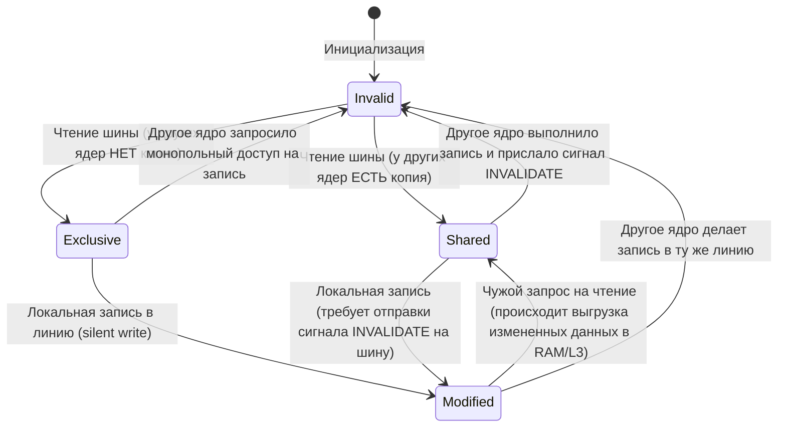

# Глава 2. Иерархия памяти: Кэш-линии, задержки и враги производительности

> [!NOTE]
> **TL;DR:** Процессор работает в сотни раз быстрее, чем оперативная память (RAM). Чтобы сгладить эту разницу, чип окружен слоями сверхбыстрой кэш-памяти L1/L2/L3. В этой главе мы изучим, как физически устроена память, почему классический объектно-ориентированный Java-код приводит к катастрофическим простоям CPU (Pointer Chasing) и как Data-Oriented Design (DOD) решает эту проблему за счет укладки данных в непрерывные кэш-линии.

---

### ⚡ БОЛЬ: Процессор «спит» 99% игрового времени из-за Memory Wall
Представь, что ты написал красивую физическую систему для вокселей на Java. У тебя есть миллионы частиц, каждая представлена объектом `Point` с координатами `x, y, z`. Ты запускаешь цикл обновления физики частиц, ожидая увидеть плавные 240 FPS. Но вместо этого игра выдает дерганые 30 FPS, хотя видеокарта и процессор загружены всего на 15%. В чем дело?

Дело в том, что ядра процессора работают на частоте 4+ ГГц (такт — 0.25 нс), а время доступа к оперативной памяти RAM составляет **50–100 наносекунд**. С точки зрения процессора, каждый запрос данных из RAM — это **вечность (200–400 тактов простоя)**. В этот момент АЛУ не совершает никаких полезных вычислений — оно просто "спит", ожидая прибытия электрических зарядов из планок памяти. Это явление называется **Стеной памяти (Memory Wall)**.

**Решение:** Отказаться от хаотичного разбрасывания объектов по памяти кучи (Heap) и перейти к **Data-Oriented Design (DOD)**. Мы научимся проектировать структуры данных так, чтобы они располагались в памяти строго последовательно, едиными плоскими массивами примитивов. Это позволит процессору за один раз загружать данные сразу для десятков объектов в ультрабыстрый кэш L1, сводя промахи памяти к абсолютному нулю.

---

В Главе 1 мы препарировали процессорное ядро и поразились его скорости. Современное арифметико-логическое устройство (АЛУ) способно выполнять операции с тактовой частотой 4.0 ГГц и выше. Один такт вычислений длится ничтожные **0.25 наносекунды**. За это время свет в вакууме успевает пройти всего 7.5 сантиметров, а электрический сигнал в медном проводнике материнской платы — около 4-5 сантиметров. 

Здесь мы упираемся в жесткую физическую реальность, известную как **Стена памяти (Memory Wall)**. 

Пока ядра процессора развивались экспоненциально, следуя закону Мура, скорость доступа к оперативной памяти (RAM) росла черепашьими темпами. Физическое расстояние от кристалла CPU до планок оперативной памяти на материнской плате составляет от 5 до 12 сантиметров. Чтобы сигнал дошел до контроллера памяти, прошел через шину, активировал ячейки DRAM, считал данные и вернулся обратно, требуется от **50 до 100 наносекунд**. 

Для АЛУ, щелкающего такты за 0.25 нс, это означает **простой в 200–400 тактов**. Каждый раз, когда процессору нужно прочитать значение из RAM, он впадает в глубокую летаргическую кому. Чтобы спасти процессор от постоянного простоя, инженеры окружили ядра каскадом сверхбыстрой локальной памяти. 

В этой главе мы разберем физику кремния, из которого построена память, изучим устройство кэш-памяти до бита и поймем, как писать код для 3D-движка Zenith так, чтобы процессор никогда не ждал.

---

## 1. Битва физики и экономики: SRAM против DRAM

В основе компьютерной памяти лежат два кардинально разных физических способа хранения бинарного нуля или единицы: статический (SRAM) и динамический (DRAM). Это классический компромисс между скоростью, плотностью размещения элементов и стоимостью.

```
                  ┌─────────────────────────────────────────┐
                  │          Компьютерная Память            │
                  └────────────────────┬────────────────────┘
                                       │
            ┌──────────────────────────┴──────────────────────────┐
            ▼                                                     ▼
┌───────────────────────┐                             ┌───────────────────────┐
│         SRAM          │                             │         DRAM          │
│  (Статическая RAM)    │                             │  (Динамическая RAM)   │
├───────────────────────┤                             ├───────────────────────┤
│ • 6 транзисторов (6T) │                             │ • 1 транзистор +      │
│ • Триггерная схема    │                             │   1 конденсатор (1T1C)│
│ • Сверхбыстрая (~1нс) │                             │ • Хранение заряда     │
│ • Дорогая, низкая     │                             │ • Медленная (~60нс)   │
│   плотность записи    │                             │   Высокая плотность   │
│ • Применение: Кэши    │                             │ • Применение: RAM     │
└───────────────────────┘                             └───────────────────────┘
```

### SRAM (Static RAM): Царство триггеров и мгновенной реакции

Ячейка статической памяти хранит бит данных без необходимости постоянного обновления. Физически она представляет собой полупроводниковый **триггер (Latch)**, построенный на базе перекрестно связанных инверторов. В современной схемотехнике стандартом является **шеститранзисторная ячейка (6T-SRAM)**.

```
               +Vcc (Питание)
                   │
             ┌─────┴─────┐
             │    T2     │ (PMOS)
             └─────┬─────┘
         ┌─────────┼─────────┐
         │         │         │
      ┌──┴──┐   ┌──┴──┐   ┌──┴──┐
      │ T1  │   │ T3  │   │ T4  │ (NMOS)
      └──┬──┘   └──┬──┘   └──┬──┘
         │         │         │
  [Q] ───┼─────────┴─────────┼─── [/Q] (Инвертированный выход)
 (Бит)   │                   │
      ┌──┴──┐             ┌──┴──┐
      │ T5  │             │ T6  │ (Транзисторы доступа)
      └──┬──┘             └──┬──┘
         │                   │
      Bit Line (BL)       Bit Line Bar (BLB)
```

* **Физика процесса**: Транзисторы $T1, T2$ и $T3, T4$ образуют два КМОП-инвертора. Выход первого инвертора ($Q$) заведен на вход второго, а выход второго ($/Q$) — на вход первого. Это создает устойчивую положительную обратную связь. Если на точке $Q$ установился высокий потенциал (логическая `1`), он запирает транзисторы второго инвертора, удерживая на точке $/Q$ низкий потенциал (логический `0`). Тот в свою очередь подтверждает «единицу» на первом инверторе.
* **Почему она быстрая**: Переключение состояния триггера происходит практически мгновенно — за время задержки затвора транзистора (доли пикосекунд). Здесь нет никаких емкостей, которые нужно долго заряжать или разряжать.
* **Почему она дорогая**: Для хранения всего одного бита требуется **6 транзисторов**. На кремниевом кристалле такая структура занимает огромную площадь. Попытка сделать оперативную память объемом 32 ГБ целиком на SRAM привела бы к созданию процессора размером с письменный стол стоимостью в сотни тысяч долларов, который плавился бы от собственного тепловыделения.
* **Сфера применения**: Сверхбыстрая кэш-память процессора (L1, L2, а также частично L3).

### DRAM (Dynamic RAM): Микроконденсаторы и борьба с энтропией

Ячейка динамической памяти устроена гениально просто: она состоит всего из **одного транзистора и одного конденсатора (схема 1T1C)**.

```
       Bitline (Линия чтения/записи данных)
         │
         ▼
         │
       ┌─┴─┐
  ────┤ T ├───── Wordline (Линия выбора строки)
       └─┬─┘
         │
       ┌─┴─┐
       │ C │ (Конденсатор хранит заряд: Q = 1, 0 = 0)
       └─┬─┘
         │
        GND (Земля)
```

* **Физика процесса**: Логическая единица кодируется наличием электрического заряда на микроскопическом конденсаторе $C$, а логический ноль — его отсутствием. Полевой транзистор $T$ выступает в роли простого выключателя. Когда на затвор транзистора через линию выбора строки (`Wordline`) подается напряжение, транзистор открывается, соединяя обкладку конденсатора с линией чтения-записи (`Bitline`).
* **Почему она медленная (Три всадника задержки)**:
  1. **Разрушающее чтение (Destructive Read)**: Когда транзистор открывается для чтения, накопленный на конденсаторе заряд неизбежно «стекает» в паразитную емкость линии `Bitline` для детектирования чувствительным усилителем (Sense Amplifier). В этот момент конденсатор разряжается. Процесс чтения уничтожает данные. Поэтому контроллер памяти обязан произвести фазу **восстановления данных (Precharge/Restore)** — принудительно зарядить конденсатор обратно после каждого чтения, что удваивает время цикла доступа.
  2. **Токи утечки и регенерация (Refresh)**: Конденсатор в DRAM имеет микроскопический размер (порядка нескольких фемтофарад) и окружен кремнием. Из-за физического несовершенства диэлектриков заряд с него постоянно утекает в подложку. Период полураспада заряда исчисляется миллисекундами. Чтобы данные не превратились в мусор, контроллер памяти приостанавливает обслуживание процессора и циклически считывает и перезаписывает каждую ячейку. Этот процесс называется **регенерацией (DRAM Refresh)**. Современные стандарты (DDR4/DDR5) требуют обновлять каждую ячейку раз в **64 мс** (или **32 мс** при высоких температурах). Во время тактов регенерации (команда `REFRESH`, параметры таймингов `tRFC` и `tREFI`) память блокируется, создавая непредсказуемые фризы в рендеринге чанков Zenith.
  3. **Координатная адресация (RAS/CAS)**: Память организована в виде двумерной матрицы строк и столбцов. Чтобы прочитать байт, нужно сначала подать адрес строки (Row Address Strobe, `RAS`), подождать стабилизации напряжения (`tRCD`), затем подать адрес столбца (Column Address Strobe, `CAS`), подождать задержку выдачи данных (латентность `CL`), переписать данные обратно и закрыть строку (`tRP`). Все эти физические процессы требуют десятков наносекунд.

---

## 2. Пирамида скоростей: Тактовая шкала времени

### ⏱️ Перевод наносекунд в масштабы реального времени

Сухие цифры задержек в наносекундах тяжело воспринимаются человеческим мозгом. Чтобы почувствовать физическую пропасть между процессором и памятью, переведем **1 такт процессора (0.25 нс) в 1 секунду** нашей реальной жизни. 

Представь, что ты — программист-архитектор движка Zenith, сидящий за рабочим столом:
* **L1 Cache (Регистры CPU):** Взять ручку со стола, чтобы записать число (**1 секунда**). Всё под рукой, задержка нулевая.
* **L2/L3 Cache (Кэш процессора):** Встать и сходить за нужной технической книгой в шкаф на другом конце комнаты (**10–60 секунд**). Приемлемо, но требует отвлечься от работы.
* **RAM (Оперативная память):** Выйти из офиса, поймать такси, поехать в центральную городскую библиотеку в другой район, оформить абонемент, найти нужную книгу на полке и вернуться назад (**несколько месяцев!**). В это время вся работа в офисе полностью заблокирована.
* **NVMe SSD (Накопитель):** Собрать чемодан, доехать до аэропорта, купить билет, улететь на другой континент в национальный архив, переписать рукопись вручную и прилететь обратно (**несколько десятков лет!**).

Теперь понятно, почему промах кэша (Cache Miss) так страшен. Каждый раз, когда ваш Java-код промахивается мимо кэша и лезет в RAM, процессор бросает все дела и отправляется в "длительную поездку в библиотеку" за одним-единственным байтом!

---

Чтобы наглядно осознать пропасть между скоростями выполнения инструкций и доставкой данных из физических чипов памяти, обратимся к аналогии с шеф-поваром на кухне ресторана Zenith. 

Представь, что **1 такт процессора (0.25 нс) равен 1 секунде** человеческого времени. Наш шеф-повар пытается приготовить изысканное воксельное блюдо:

| Уровень памяти | Физическое расположение | Задержка (в тактах) | Реальное время | Аналогия масштаба времени (1 такт = 1 секунда) |
| :--- | :--- | :--- | :--- | :--- |
| **Регистры общего назначения (GPR)** | Непосредственно внутри АЛУ | **0 тактов** | $< 0.1$ нс | Нож или специя уже находятся в руках повара. Работа идет мгновенно. |
| **Кэш L1d / L1i (Гарвардский)** | На ядре CPU (32-64 КБ на ядро) | **4-5 тактов** | $\approx 1$–$1.2$ нс | Специи и ингредиенты лежат на разделочной доске прямо перед поваром. Нужно протянуть руку (**4–5 секунд**). |
| **Кэш L2 (Выделенный)** | На ядре CPU (512 КБ–2 МБ на ядро) | **12-14 тактов** | $\approx 3$–$3.5$ нс | Ингредиенты лежат в ящике стола под рукой. Нужно наклониться и открыть ящик (**12–14 секунд**). |
| **Кэш L3 (LLC - Last Level Cache)** | Общий на весь кристалл CPU (16–96 МБ) | **40-60 тактов** | $\approx 10$–$15$ нс | Нужно отойти от стола и взять продукт из холодильника на кухне (**40–60 секунд** — около минуты). |
| **Оперативная память (DRAM)** | Вне кристалла (шины DDR4/DDR5) | **200-400 тактов** | $\approx 60$–$100$ нс | В холодильнике пусто. Повару нужно одеться, выйти из ресторана, поймать такси, доехать до круглосуточного гипермаркета, купить продукты и вернуться обратно (**3–6 минут** простоя). |
| **NVMe SSD (PCIe M.2)** | На материнской плате через шину PCIe | **10 000 - 50 000 тактов** | $\approx 10$–$50$ мкс | Продуктов нет в городе. Нужно собрать чемодан, купить билет на самолет, улететь в другую страну на банановую плантацию и собрать урожай (**от 3 часов до полусуток** ожидания). |

Если наш движок Zenith на каждую итерацию отрисовки полигонов обращается напрямую к оперативной памяти, то 99% времени наш "шеф-повар" просто стоит у пустого разделочного стола, ожидая курьера с продуктами.

---

## 3. Анатомия кэш-линии (Cache Line) и структура MESI

Для эффективной борьбы со «Стеной памяти» процессоры опираются на два фундаментальных принципа:
1. **Временная локальность (Temporal Locality)**: Если программа обратилась к ячейке памяти `A`, с огромной вероятностью она обратится к ней снова в ближайшее время (пример: счетчик цикла, локальная переменная).
2. **Пространственная локальность (Spatial Locality)**: Если программа обратилась к ячейке `A`, с высокой вероятностью она вскоре обратится к ячейке `A + 1`, `A + 2` и т.д. (пример: чтение массива данных).

Чтобы реализовать пространственную локальность, процессор никогда не общается с системной RAM побайтово. Вся память разбита на физические блоки фиксированного размера — **кэш-линии (Cache Lines)**. На архитектуре x86-64 размер кэш-линии составляет строго **64 байта** (512 бит).

```
   Физическая кэш-линия на кристалле (Общий размер ~74-76 байт):
  ┌───────────────────────┬──────────────┬──────────────────────────────────────────┐
  │   Статусные биты      │  Тег (Tag)   │            Полезные данные               │
  │ (MESI, Valid, Dirty)  │              │            (Data - 64 байта)             │
  └───────────────────────┴──────────────┴──────────────────────────────────────────┘
           ▲                     ▲                            ▲
      Определяют             Старшие биты              Физические байты
     статус линии           адреса в RAM              информации для АЛУ
```

Когда процессор запрашивает 4-байтовую переменную типа `float` по адресу `0x1004`, аппаратный контроллер памяти делает следующее:
1. Вычисляет границы 64-байтного блока, в который попадает данный адрес (`0x1000` - `0x103F`).
2. Загружает по шине всю 64-байтную кэш-линию целиком во все уровни кэша (L3 $\rightarrow$ L2 $\rightarrow$ L1d).
3. Извлекает нужные 4 байта и передает их в регистр.
4. Если следующим шагом алгоритм Zenith читает соседний `float` по адресу `0x1008`, процессор достает его из L1d кэша за **0.25 наносекунды** без единого обращения к внешней памяти!

### Адресация в Set-Associative кэше

Современные процессоры используют **множественно-ассоциативную архитектуру (N-Way Set Associative Cache)**. Кэш-память делится на наборы (Sets), каждый из которых содержит $N$ кэш-линий (путей ассоциативности, Ways). Например, типичный кэш L1d объемом 32 КБ с 8-канальной ассоциативностью (8-way) содержит 64 набора ($32 \text{ КБ} / (64 \text{ байта} \cdot 8) = 64$ набора).

Когда АЛУ генерирует физический адрес памяти, MMU разбивает его на три составляющих сегмента:

```
  64-битный физический адрес памяти:
  ┌───────────────────────────────────────────────┬──────────────────────┬─────────────┐
  │                   Тег (Tag)                   │    Индекс (Index)    │ Смещение    │
  │                  (48-12 бит)                  │     (11-6 бит)       │ (Offset)    │
  │                                               │                      │ (5-0 бит)   │
  └───────────────────────────────────────────────┴──────────────────────┴─────────────┘
                         │                                    │                 │
                         ▼                                    ▼                 ▼
             Сравнивается параллельно               Выбирает один из       Выбирает байт
             с тегами в выбранном наборе            64 наборов кэша       внутри 64 байт
```

1. **Смещение (Offset, младшие 6 бит, т.к. $2^6 = 64$)**: Указывает конкретный байт внутри загруженной 64-байтной кэш-линии.
2. **Индекс набора (Index, следующие 6 бит)**: Выбирает один из 64 наборов кэш-памяти, куда физически может быть отображен данный адрес.
3. **Тег (Tag, оставшиеся старшие биты)**: Уникальный идентификатор исходного физического адреса памяти. Процессор параллельно сравнивает тег запроса со всеми 8 тегами кэш-линий, хранящихся в выбранном наборе.
   - Если тег совпал и статус-бит активен — это **попадание в кэш (Cache Hit)**.
   - Если совпадений нет — **промах (Cache Miss)**. Происходит вытеснение одной из старых линий (обычно по алгоритму LRU - Least Recently Used) и загрузка новой.

### Межядерная когерентность: Протокол MESI

В многоядерных процессорах у каждого ядра есть физически независимые кэши L1 и L2. Но что произойдет, если Ядро 1 изменит значение переменной в своей кэш-линии, в то время как Ядро 2 работает с копией той же самой линии? Без строгой синхронизации ядра мгновенно разойдутся в показаниях реальности.

Для решения этой проблемы на аппаратном уровне работает транзисторный автомат когерентности кэшей по протоколу **MESI**. Каждая кэш-линия маркируется одним из четырех статусов:



* **M (Modified — Изменена)**: Кэш-линия присутствует *только* в кэше текущего ядра, и её данные были модифицированы (отличаются от данных в RAM/L3). Ядро несет единоличную ответственность за эти данные. При попытке другого ядра прочитать этот адрес, текущее ядро обязано перехватить запрос, сбросить измененные данные в L3/RAM и перевести линию в статус Shared.
* **E (Exclusive — Монопольная)**: Кэш-линия присутствует *только* в кэше текущего ядра, но её данные полностью идентичны RAM/L3. Ядро может мгновенно изменить эти данные локально без уведомления остальных ядер по межъядерной шине (интерконнекту), переведя ее в статус `M`.
* **S (Shared — Разделяемая)**: Кэш-линия загружена в кэши нескольких ядер одновременно и совпадает с RAM/L3. Ядра могут читать её с максимальной скоростью. Однако, если Ядро 1 решит изменить данные в этой линии, оно обязано выдать в межъядерную шину широковещательный сигнал **Invalidate (Инвалидация)**.
* **I (Invalid — Недействительная)**: Линия пуста или её данные устарели из-за того, что другое ядро выполнило запись. Любая попытка прочитать данные из этой линии приводит к аппаратному кэш-промаху и требует нового физического чтения по шине.

---

## 4. Аппаратный Hardware Prefetching: Заглядывая за горизонт

Если бы процессор просто пассивно ждал кэш-промахов, производительность современных программ оставалась бы низкой. Чтобы этого не происходило, внутри процессора работает невидимый интеллектуальный агент — **Аппаратный предвыборщик (Hardware Prefetcher)**.

Hardware Prefetcher — это выделенный транзисторный блок на кристалле процессора (обычно расположенный на уровне кэшей L1d и L2), который анализирует историю обращений к памяти и пытается предсказать будущие запросы.

```
   [ АЛУ запрашивает: 0x1000 ]  ──> Обычный доступ
   [ АЛУ запрашивает: 0x1040 ]  ──> Prefetcher активируется
   [ АЛУ запрашивает: 0x1080 ]  ──> Prefetcher определяет паттерн (Stride = +64)
                                ──> Спекулятивно загружает 0x10C0 и 0x1100 в L2/L1d
                                    до того, как АЛУ выдаст реальный запрос!
```

### Основные алгоритмы префетчинга

1. **Стриминговый префетчер (Spatial/Streaming Prefetcher)**:
   Он отслеживает последовательные запросы к кэш-линиям. Если программа последовательно читает линию `N`, затем `N+1`, префетчер понимает, что идет линейное сканирование памяти. Он спекулятивно отправляет запросы на чтение линий `N+2`, `N+3` и `N+4` из внешней RAM в кэш L2/L1d.
2. **Шаговый префетчер (Stride Prefetcher)**:
   Более продвинутый алгоритм, способный распознавать регулярные шаги (stride) обращения. Если программа обходит память с фиксированным шагом (например, прыгает по структурам данных в цикле: адрес `A`, `A+256`, `A+512`), Stride Prefetcher вычисляет разность и начинает упреждающую загрузку адресов `A+768` и `A+1024`.

> [!IMPORTANT]
> **Золотое правило производительности**:
> Аппаратный префетчер обожает непрерывные линейные массивы данных. Он идеально работает, когда вы обходите память по порядку. Но префетчер абсолютно бессилен перед хаотичными прыжками по указателям в связанных структурах данных. Каждый непредсказуемый прыжок по ссылке «ослепляет» префетчер, заставляя процессор экстренно останавливать конвейер и ждать сотни тактов холодной загрузки из RAM.

---

## 5. Локальность данных и кошмар Pointer Chasing в JVM

Разработчики на Java часто забывают, что виртуальная машина JVM абстрагирует их от физического устройства памяти. Но за абстракции приходится платить колоссальным падением производительности игрового движка из-за эффекта **Pointer Chasing (Погоня за указателями)**.

Рассмотрим классическую структуру воксельной геометрии Zenith, написанную в наивном ООП-стиле:

```java
// Класс вокселя (16 байт под капотом JVM)
class Voxel {
    byte type;
    byte light;
    short flags;
}

// Наивный массив вокселей в чанке
Voxel[] voxels = new Voxel[4096];
```

Давайте посмотрим, как эта структура физически располагается в оперативной памяти компьютера на уровне JVM:

```
    Массив voxels в куче (Heap):
    ┌──────────────────┬──────────────┬──────────────┬──────────────┐
    │ Заголовок класса │ Ссылка на [0]│ Ссылка на [1]│ Ссылка на [2]│ ... 4096 ссылок
    └──────────────────┴──────┬───────┴──────┬───────┴──────┬───────┘
                              │              │              │
                              ▼              ▼              ▼
                       ┌─────────────┐┌─────────────┐┌─────────────┐
                       │ Voxel [0]   ││ Voxel [2]   ││ Voxel [1]   │  (Разбросаны хаотично
                       │ в памяти    ││ в памяти    ││ в памяти    │   в куче сборщиком мусора!)
                       └─────────────┘└─────────────┘└─────────────┘
```

### 🔍 Метафора Pointer Chasing: Ловушка квеста в библиотеке

Представьте себе концепцию **Pointer Chasing (Погоня за указателями)** на нашей временной шкале:

Вы совершили тяжелое путешествие в библиотеку (RAM), которое заняло **несколько месяцев**, чтобы забрать важную книгу по физике вокселей. Вы подходите к нужной полке, но вместо книги обнаруживаете там маленькую записку: *«Книга перенесена во второй филиал по адресу ул. Ленина, 10»*. 

Вам приходится тратить еще **несколько месяцев** на поездку во второй филиал. Вы прибегаете туда, открываете ящик, а там лежит следующая записка: *«Книга выдана читателю по адресу пр. Мира, 4»*. 

Вы тратите еще **несколько месяцев** на поездку по новому адресу. Вы буквально гоняетесь за указателями, совершая колоссальные траты времени, в то время как полезная работа стоит на месте.

В программировании это происходит каждый раз, когда процессор разыменовывает цепочку ссылок: `player.getComponent(Physics.class).getPosition().getX()`. Каждый вызов `.get()` — это новая поездка в библиотеку за новой запиской!

---

### 🔴 Драматизация Garbage Collector: Грех выделения new в рендере

Когда начинающие Java-разработчики пишут игровой цикл на LWJGL, они совершают фундаментальную ошибку: выделяют временную память под мелкие объекты (векторы, матрицы, временные AABB-боксы) прямо внутри метода `render()` или `tick()`, надеясь на "всемогущий сборщик мусора".

Давайте наглядно визуализируем графики фреймтайма (времени рендеринга кадра) в двух случаях:

```
[ График 1: Выделение временных векторов через new Vector3f() в цикле рендера ]

150 мс ───                     █ (GC Stop-The-World Pause!)
          │                     █
 50 мс ───                     █              █ (GC Pause!)
          │                     █              █
 16 мс ───▄  ▄  ▄  ▄  ▄  ▄  ▄  █  ▄  ▄  ▄  ▄  █  ▄  ▄  ▄  ▄  ▄ (Адский Stuttering!)
          └─────────────────────────────────────────────────────► Время (кадры)
```

```
[ График 2: Использование Object Pooling и непрерывных плоских массивов примитивов ]

 16 мс ───▄  ▄  ▄  ▄  ▄  ▄  ▄  ▄  ▄  ▄  ▄  ▄  ▄  ▄  ▄  ▄  ▄  ▄  ▄ (Идеально плавные FPS)
          └─────────────────────────────────────────────────────► Время (кадры)
```

#### Почему происходит катастрофа?
Когда в цикле, выполняющемся 144 раза в секунду для миллионов вокселей, вы пишете `new Vector3f()`, миллионы мелких объектов мгновенно заполняют область памяти **Eden Space (молодое поколение)**. 

Сборщик мусора (GC) не может работать незаметно. Даже продвинутые сборщики (G1GC или ZGC) вынуждены приостанавливать выполнение программы — делать короткие **Stop-The-World паузы**, чтобы просканировать граф живых ссылок в Heap, отделить живое от мусора и дефрагментировать память. 

Каждая такая пауза — это мгновенный фриз игры (Stuttering), во время которого игра застывает на 50–150 мс. Прощай, плавный геймплей!

#### Как с этим борется Zenith?
1. **Object Pooling (Пул объектов):** Мы создаем пул векторов и переиспользуем их. Вместо `new Vector3f()` мы просим вектор из пула: `Vector3f v = Pool.obtain()`, а после расчетов возвращаем его обратно: `Pool.free(v)`. Ноль аллокаций в куче!
2. **Память вне кучи (Off-Heap / ByteBuffers):** Для отправки мешей на GPU мы используем прямые нативные буферы `ByteBuffer.allocateDirect()`, которые не контролируются сборщиком мусора Java и не вызывают никаких пауз.

---

### Проблема Pointer Chasing

В Java массив объектов `Voxel[]` — это **массив ссылок (указателей)** на объекты, а не массив самих объектов! В 64-битной JVM каждая ссылка занимает 4 или 8 байт (в зависимости от флага `-XX:+UseCompressedOops`). 

Когда мы пишем простой цикл расчета освещения:
```java
for (int i = 0; i < voxels.length; i++) {
    sumLight += voxels[i].light; // Точка катастрофы!
}
```

Процесс на аппаратном уровне превращается в сущий кошмар:
1. **Первый Cache Miss**: Процессор считывает массив `voxels`. Он загружает 64-байтную кэш-линию, содержащую ссылки на воксели. Это проходит быстро.
2. **Второй Cache Miss (Pointer Chasing)**: Процессор берет ссылку `voxels[0]` (например, адрес `0x9FA0`). Ему нужно прочитать поле `light`. Происходит разыменование указателя. Процессор лезет по адресу `0x9FA0`. Данных по этому адресу нет в кэше! Процессор блокируется на **200 тактов**, пока память достает объект `Voxel[0]`.
3. **Третий Cache Miss**: Цикл переходит к `voxels[1]`. Ссылка указывает на адрес `0x4B30`. Поскольку GC (Garbage Collector) выделял память в разное время или перемещал объекты при дефрагментации, объект `Voxel[1]` лежит в совершенно другом месте кучи, далеко от `Voxel[0]`. Кэш-линия, загруженная для `Voxel[0]`, абсолютно бесполезна. Процессор снова блокируется на **200 тактов**, дожидаясь загрузки `Voxel[1]`.

В итоге вместо непрерывной обработки данных процессор тратит 99% времени на «погоню за указателями» (Pointer Chasing), выбивая свой собственный кэш хаотично загруженными линиями.

### 📊 Контраст памяти: OOP vs DOD Layout

Чтобы окончательно закрепить разницу между классическим объектно-ориентированным стилем (OOP) и ориентированным на данные проектированием (DOD), сравним структуру их размещения в физической памяти (Cache Lines):

```
[ ООП-стиль: Массив объектов Voxel[] с кучей указателей ]

Индекс массива в Heap (Ссылки):
┌──────────────┬──────────────┬──────────────┬──────────────┐
│ Ссылка на [0]│ Ссылка на [1]│ Ссылка на [2]│ Ссылка на [3]│ (Лежат рядом, но ведут в разные места)
└──────┬───────┴──────┬───────┴──────┬───────┴──────┬───────┘
       │              │              │              │
       │  ┌───────────┘              │              └───────────────┐
       ▼  ▼                          ▼                              ▼
    ┌──────────────────────┐      ┌──────────────────────┐      ┌──────────────────────┐
    │ Объект Voxel[1]      │      │ Объект Voxel[0]      │      │ Объект Voxel[2]      │
    │ - Заголовок (12 б)   │      │ - Заголовок (12 б)   │      │ - Заголовок (12 б)   │
    │ - type, light, flags │      │ - type, light, flags │      │ - type, light, flags │
    └──────────────────────┘      └──────────────────────┘      └──────────────────────┘
    (Объекты хаотично разбросаны по всей куче Heap. Каждый доступ — Cache Miss!)
```

```
[ DOD-стиль: Плоский плотный массив примитивов float[] / byte[] ]

Адрес памяти (Непрерывный физический блок на планке RAM):
┌──────┬──────┬──────┬──────┬──────┬──────┬──────┬──────┬──────┬──────┬──────┬──────┐
│  X1  │  Y1  │  Z1  │  X2  │  Y2  │  Z2  │  X3  │  Y3  │  Z3  │  X4  │  Y4  │  Z4  │
└──────┴──────┴──────┴──────┴──────┴──────┴──────┴──────┴──────┴──────┴──────┴──────┘
◄─────────────────────────── Физическая Cache Line (64 байта) ─────────────────────────►
 
(Все данные лежат строго последовательно. При чтении координаты X1, процессор 
 АВТОМАТИЧЕСКИ загружает в L1 кэш координаты Y1, Z1 и координаты еще нескольких 
 следующих вокселей. 100% Cache Hits!)
```

---

### Решение Zenith: Плоские массивы примитивов (Flat Arrays) и байт-схемы

Чтобы обойти это ограничение до релиза проекта **Valhalla** (который должен привнести полноценные плоские структуры `value types` в JVM), в ядре Zenith используется низкоуровневая раскладка данных с использованием плоских массивов примитивов и байт-схем.

Вместо массива объектов мы храним данные в одном плоском упакованном массиве типа `byte` или `long`, где все поля вокселей лежат друг за другом:

```java
// Все данные 4096 вокселей лежат в одном последовательном массиве примитивов!
// Каждый воксель занимает ровно 4 байта: [Type (1B)] [Light (1B)] [Flags (2B)]
byte[] voxelData = new byte[4096 * 4];

// Чтение освещения вокселя по индексу
public static byte getLight(byte[] data, int voxelIndex) {
    int byteOffset = voxelIndex * 4;
    return data[byteOffset + 1]; // Быстрое вычисление смещения без разыменования!
}
```

```
   Физическая структура плоского массива voxelData в кэш-линии (64 байта):
  ┌────────────────────────────────────────────────────────────────────────┐
  │ Voxel 0    │ Voxel 1    │ Voxel 2    │ Voxel 3    │ Voxel 4    │ ...       │
  ├────────────┼────────────┼────────────┼────────────┼────────────┼───────────┤
  │ T L F F    │ T L F F    │ T L F F    │ T L F F    │ T L F F    │ ...       │
  └────────────────────────────────────────────────────────────────────────┘
  ▲                                                                        ▲
  └─────────────────────────── Ровно 16 вокселей ──────────────────────────┘
                      умещаются в ОДНУ кэш-линию целиком!
```

* **Фантастическая кэш-локальность**: За один промах кэша (200 тактов) процессор загружает в L1d кэш данные **16 вокселей сразу**!
* **Идеальная работа Prefetcher**: Аппаратный предвыборщик видит последовательное чтение массива `voxelData` байт за байтом и упреждающе загружает следующие чанки данных из оперативной памяти. Процессор щелкает вычисления на полной скорости конвейера, выдавая максимальный FPS.

---

## 6. False Sharing: Ложное разделение и его подавление

Аппаратная когерентность кэшей по протоколу MESI таит в себе смертельную опасность для многопоточного кода игры Zenith. Это явление называется **False Sharing (Ложное разделение)**.

Представь класс планировщика потоков рендеринга:

```java
class RenderThreadsMetadata {
    // Количество задач, выполненных первым ядром (пишет Поток 1 на Ядре 1)
    public volatile long tasksCore1; 
    // Количество задач, выполненных вторым ядром (пишет Поток 2 на Ядре 2)
    public volatile long tasksCore2; 
}
```

Логически эти переменные абсолютно независимы. Поток 1 никогда не читает и не пишет в `tasksCore2`, и наоборот. 

Но давай посмотрим, что происходит в физической памяти. Тип `long` занимает 8 байт. Две переменные вместе занимают 16 байт и гарантированно попадают в **одну общую 64-байтовую кэш-линию**.

```
    Физическая кэш-линия в кэшах L1д ядер CPU:
    ┌───────────────────────────┬───────────────────────────┬──────────────────┐
    │      tasksCore1 (8B)      │      tasksCore2 (8B)      │ Остальные (48B)  │
    └───────────────────────────┴───────────────────────────┴──────────────────┘
                 ▲                               ▲
         Модифицирует Ядро 1              Модифицирует Ядро 2
```

### Хроника кэш-катастрофы (MESI Ping-Pong):

1. **Шаг 1**: Ядро 1 загружает кэш-линию в свой кэш L1d. Статус линии: **Exclusive (E)**.
2. **Шаг 2**: Ядро 2 загружает эту же кэш-линию. Протокол MESI переводит её на обоих ядрах в статус **Shared (S)**.
3. **Шаг 3**: Поток 1 на Ядре 1 инкрементирует `tasksCore1`. Ядро 1 переводит свою кэш-линию в статус **Modified (M)** и мгновенно отправляет по системной шине сигнал **Invalidate** для Ядра 2.
4. **Шаг 4**: Кэш-линия на Ядре 2 переходит в статус **Invalid (I)**. Данные стерты.
5. **Шаг 5**: Поток 2 на Ядре 2 пытается обновить `tasksCore2`. Видя статус **Invalid**, Ядро 2 блокируется, совершает дорогостоящий запрос к L3 кэшу или RAM, выкачивает измененную кэш-линию обратно (тратя десятки тактов), переводит её в статус **Modified (M)** и шлет сигнал **Invalidate** Ядру 1!
6. **Шаг 6**: Теперь Ядро 1 пытается обновить `tasksCore1` и уходит в ступор ожидания инвалидации.

Этот процесс называется **Cache Line Bouncing (Пинг-понг кэш-линий)**. Физические ядра процессора тратят все свое время не на полезные расчеты, а на бесконечные пересылки 64-байтных пакетов данных по межъядерной шине туда и обратно. Производительность падает катастрофически — многопоточный код работает в разы медленнее, чем однопоточный!

### Борьба с False Sharing в Java

Существует два надежных способа борьбы с ложным разделением в высоконагруженных системах:

#### Способ 1. Ручное выравнивание (Padding / Отступы)

Мы можем искусственно «раздвинуть» переменные в памяти так, чтобы они гарантированно оказались в разных кэш-линиях. Для этого мы объявляем фиктивные неиспользуемые переменные типа `long` (каждая по 8 байт):

```java
class RenderThreadsMetadataManual {
    public volatile long tasksCore1;
    
    // Ручной паддинг: 7 полей по 8 байт = 56 байт отступа.
    // Гарантирует, что tasksCore2 окажется в следующей кэш-линии!
    private long p1, p2, p3, p4, p5, p6, p7; 
    
    public volatile long tasksCore2;
}
```

> [!NOTE]
> Современные оптимизирующие компиляторы Java (JIT) могут попытаться удалить неиспользуемые приватные поля `p1-p7` или переупорядочить переменные класса для более плотной упаковки. Чтобы гарантировать сохранение паддинга, приходится использовать сложные трюки с наследованием классов или использовать встроенные механизмы JVM.

#### Способ 2. Спасительная аннотация `@Contended`

Начиная с Java 8, в JVM встроен официальный и надежный инструмент борьбы с ложным разделением — аннотация `jdk.internal.vm.annotation.Contended` (или `sun.misc.Contended` в старых версиях):

```java
import jdk.internal.vm.annotation.Contended;

class RenderThreadsMetadataContended {
    @Contended
    public volatile long tasksCore1;

    @Contended
    public volatile long tasksCore2;
}
```

* **Как это работает под капотом**: Когда загрузчик классов JVM видит аннотацию `@Contended`, он автоматически добавляет пустые байтовые отступы (padding) шириной **128 байт** (размер двух стандартных кэш-линий для надежности против эффекта соседней предвыборки L2 Adjacent Cache Line Prefetcher) до и после аннотированного поля в оперативной памяти.
* **Важное требование**: По умолчанию использование этой аннотации в пользовательском коде заблокировано в целях безопасности памяти. Чтобы она заработала в движке Zenith, необходимо обязательно запускать JVM с флагом:
  `-XX:-RestrictContended`

---

## 🛠️ Практическое задание: Влияние Cache Locality на Java

Локальность данных и промахи кэша (Cache Misses) — это то, что отличает опытного системного инженера от обычного разработчика. Давай запустим в IDE бенчмарк и измерим скорость обхода огромной матрицы по строкам (Row-Major) и по столбцам (Column-Major), чтобы воочию увидеть силу кэш-линий.

[TASK:hw_memory]

---

## 7. Бесшовный мост: Выход во внешний мир

Иерархия кэшей (L1-L3), интеллектуальные механизмы ассоциативности, протоколы MESI и аппаратный транслятор адресов MMU превращают связку «CPU-Память» в замкнутую, невероятно быструю вычислительную крепость. Внутри этого ядра данные летают со скоростью света.

Но компьютер — это не просто закрытый калькулятор, перемалывающий цифры в виртуальном пространстве. 

Даже если мы идеально оптимизировали работу CPU и памяти, 3D движку Zenith нужно передать готовые буферы геометрии на видеокарту. Но GPU изолирован в своей VRAM на другом конце платы. Как передать данные сквозь материнскую плату? Переходим к шине PCIe.

---

## Вопросы для самопроверки к Главе 2

1. Почему плотность памяти SRAM намного ниже, чем DRAM, и почему это мешает сделать L1 кэш объемом 16 гигабайт?
2. Что такое «разрушающее чтение» в динамической памяти и к каким задержкам на физическом уровне оно приводит?
3. Какова роль битов `MESI` при параллельной записи в одну и ту же переменную из двух разных ядер процессора?
4. Почему при обходе двумерного массива `int[][]` по столбцам (`array[col][row]`) скорость работы программы в разы ниже, чем при обходе по строкам (`array[row][col]`)?
5. Опишите физический механизм возникновения эффекта «пинг-понга кэш-линий» при False Sharing. Как аннотация `@Contended` решает эту проблему?
