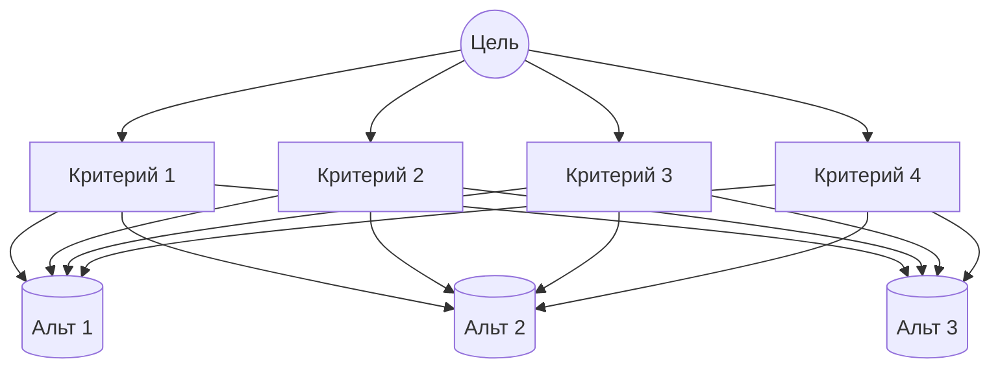

# 03.06. Метод анализа иерархий (МАИ)

### 1. Основные понятия
**Метод анализа иерархий (МАИ)** — математический инструмент системного подхода к сложным проблемам принятия решений.

МАИ не предписывает ЛПР какое-либо «правильное» решение, а позволяет ему в интерактивном режиме найти вариант (альтернативу), который наилучшим образом согласуется с пониманием сути проблемы.

МАИ позволяет понятным и рациональным образом структурировать сложную проблему принятия решений в виде иерархий.

Анализ проблемы принятия решений в МАИ начинается с построения иерархической структуры, которая включает цель, критерии, альтернативы и др. факторы, влияющие на принятие решений. Анализ ситуации выбора решения в МАИ напоминает процедуры и методы аргументации, которые используются на интуитивном уровне.

### 2. Этапы решения задач принятия решений в МАИ:
1. **Построение качественной модели решаемой проблемы** в виде иерархии, включающей:
   * цель;
   * альтернативные варианты достижения цели;
   * критерии оценки качества альтернатив.
2. **Определение приоритетов** всех элементов иерархии с использованием метода парных сравнений.
3. **Синтез глобальных приоритетов альтернатив** путём линейной свёртки приоритетов иерархии.
4. **Проверка суждений на согласованность**.
5. **Принятие решения** на основе полученных результатов.

При принятии управленческих решений с помощью МАИ ЛПР обращается к экспертам, которые создают иерархическую структуру решаемой проблемы.

**Иерархическая структура** — графическое представление проблемы в виде перевёрнутого дерева, где каждый элемент зависит от выше расположенных элементов. Связь «родитель — ребёнок» направлена сверху вниз.

*Рис 1. Иерархическая структура МАИ (альтернативы связаны по принципу «все со всеми» с критериями).*

Вершиной иерархии является главная цель. Элементы самого нижнего уровня — альтернативы. Промежуточные уровни представляют собой критерии (факторы), которые связывают цель с альтернативой.

На практике не существует установленной процедуры генерирования элементов иерархической структуры. Построение иерархии исходит из естественной способности человека думать логически и творчески, определять события и устанавливать соответствия между ними.

После построения иерархии определяются приоритеты узлов на каждом уровне:
* **Приоритеты** — числа, представляющие относительные веса элементов каждой группы сравнения на каждом уровне иерархии.
* Приоритеты являются безразмерными величинами от $0$ до $1$.

Чтобы найти приоритеты узлов иерархии, составляются **матрицы сравнений относительной важности**. Каждый элемент строки матрицы сравнивается с элементом столбца. При сравнении с самим собой отношение равно $1$.

Математическая обработка составленных матриц (суждений) заключается в вычислении **вектора локальных приоритетов**. Этот вектор выражает относительную силу (величину, ценность) каждого объекта, которые сравниваются в матрице.

Локальные приоритеты перемножаются на приоритет соответствующего критерия на вышестоящем уровне и суммируются по каждому элементу. В результате получается **вектор глобальных приоритетов**, в котором каждая компонента — это глобальный приоритет соответствующего кандидата (альтернативы).

Кандидат, соответствующий самой большой компоненте вектора глобального приоритета, является предпочтительным при выборе (наилучшим решением).
